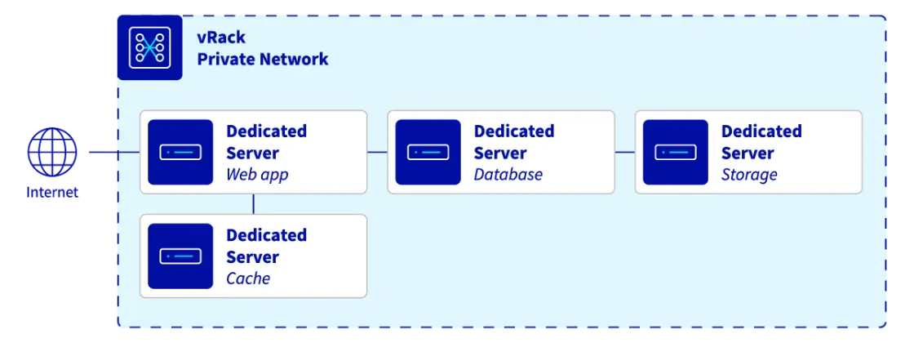
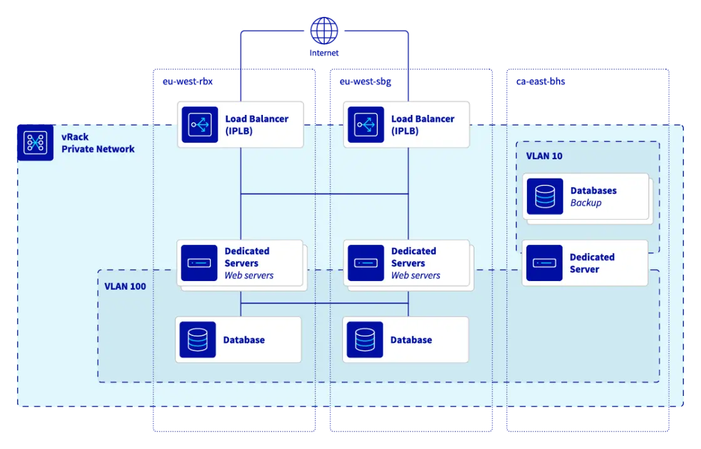
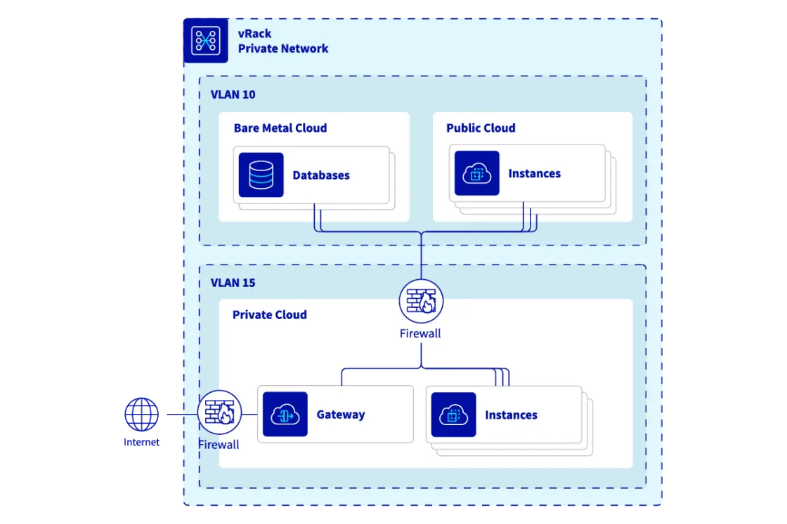
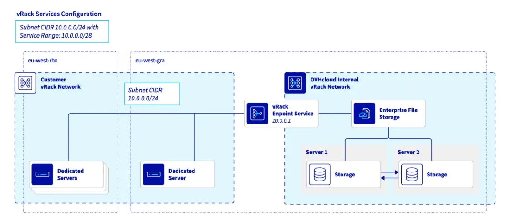
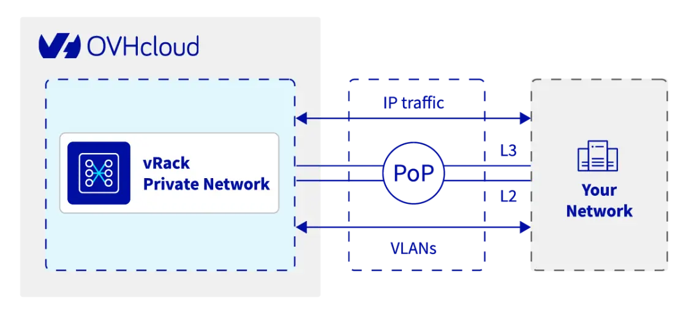
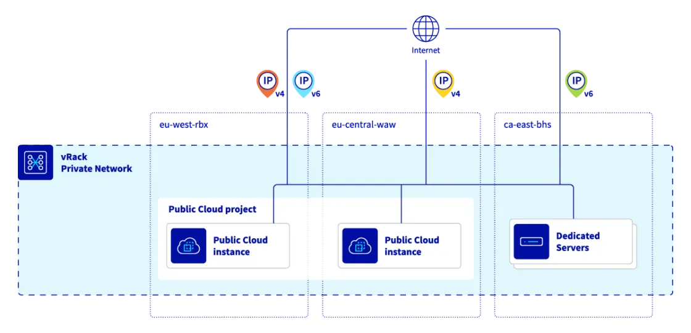

# hetzner-cloud
Scala-client for the Hetzner Cloud

This project uses Hetzner's OpenAPI spec for their Cloud API(`https://docs.hetzner.cloud/cloud.spec.json`) 
Using our Cloud API, you’re able to manage all cloud services and resources linked to them, such as Floatings IPs, Volumes and Load Balancers
`https://docs.hetzner.cloud/reference/cloud`


```json
  "mainPackage": "hcloud",
  "apiPackage": "hcloud.api",
  "modelPackage": "hcloud.models",
  "invokerPackage": ""
```
means 
hcloud
 - api
 - core
 - models

```json
  "mainPackage": "",
  "apiPackage": "hcloud.api",
  "modelPackage": "hcloud.models",
  "invokerPackage": "hcloud",

```
means 
hcloud
 - api
 - models

 
 `scala-sttp4-jsoniter` produces `sttp.client4.Request[Either[ResponseException[String], GetMultipleActionsResponse]]` for example which is just a description of the call

 `http4s-backend`	Backend	Actually sends requests using http4s client; produces SttpBackend[F, Any]
`sttp-fs2`	Streaming module	Adds support for fs2.Stream request/response bodies

### cats-effect-kernel
This is the low-level core of cats-effect.
It contains typeclasses and fundamental concurrency primitives, such as:
- Async
- Concurrent
- Spawn
- GenSpawn
- MonadCancel
- Clock
- Fiber
- Poll
- Outcome
- Typeclasses for resource safety
- Error handling structures

### cats-effect-std
This contains reusable concurrency utilities built on top of cats-effect.
It includes primitives and abstractions like:
```scala
import cats.effect.std.Console
import cats.effect.std.AtomicCell
import cats.effect.std.Backpressure
import cats.effect.std.Queue
import cats.effect.std.Semaphore
import cats.effect.std.QueueSink
import cats.effect.std.QueueSource
import cats.effect.std.Supervisor
import cats.effect.std.CountDownLatch
import cats.effect.std.CyclicBarrier
import cats.effect.std.Dequeue
import cats.effect.std.DequeueSink
import cats.effect.std.DequeueSource
import cats.effect.std.Dispatcher
import cats.effect.std.Random
import cats.effect.std.Hotswap
import cats.effect.std.MapRef
import cats.effect.std.Mutex
import cats.effect.std.PQueue
import cats.effect.std.PQueueSink
import cats.effect.std.PQueueSource
import cats.effect.std.UUIDGen
```
`cats-effect-std` depends on `cats-effect-kernel`

vRack is a proprietary private networking solution specific to OVHcloud.


It's designed to connect and isolate various OVHcloud services (Bare Metal servers, Public Cloud instances, Private Cloud, etc.) within a single, private Layer 2 network (VLANs).


OVHcloud's vRack private network technology offers a versatile solution for creating complex, secure and scalable network infrastructures. From basic private connectivity to multi-tenant private environments and public exposition of private services.

The OVHcloud vRack (virtual rack) allows multiple servers to be grouped together (regardless of number and physical location in our data centres) and connects them to a virtual switch within the same private network. Your servers can communicate privately and securely between each other, within a dedicated VLAN

### Cloud private networks
The vRack enables you to isolate your critical servers within a private VLAN. Your data is secure and communication between your servers is not routed via the public network.



### Multi-tenancy
The vRack is a private network that spreads across all OVHcloud locations, allowing you to build a highly available or distributed worldwide infrastructure for your applications, to the region of your choice.

Deploy up to 4000 private VLANs per vRack network to isolate your data even further in multi-tenant environments


### Cross Product
The vRack adapts to the needs of your business. Build your infrastructure using the products and services of our Bare Metal, Public Cloud or Private Cloud universes.


### Managed Services


### Hybrid Cloud


### Internet Gateway
