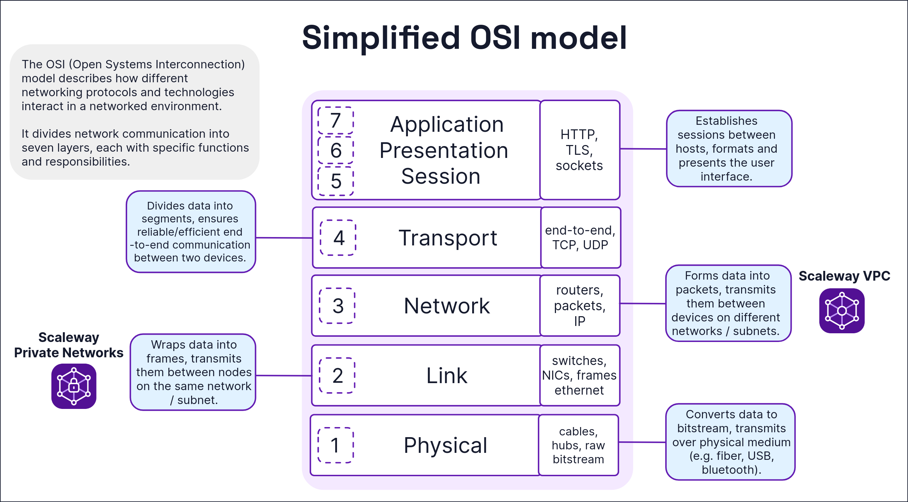
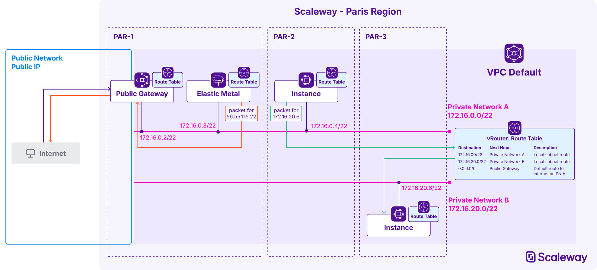
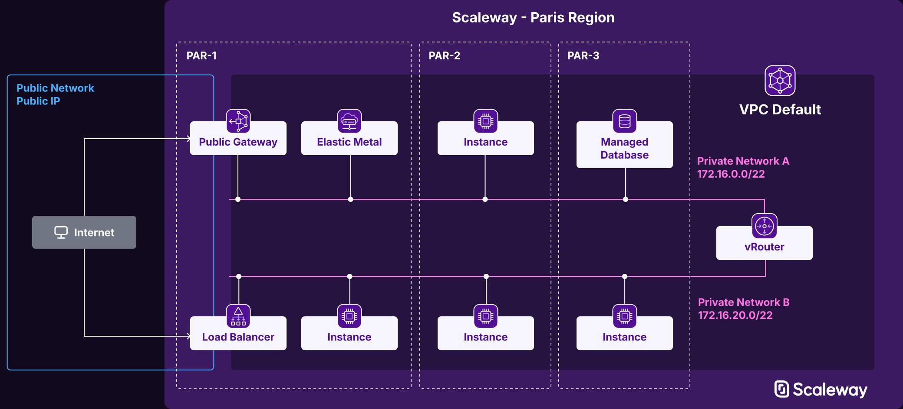
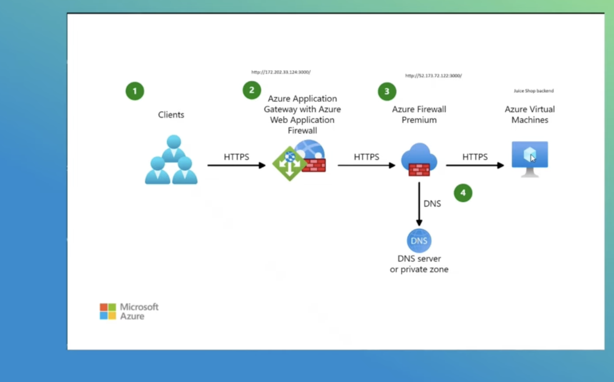
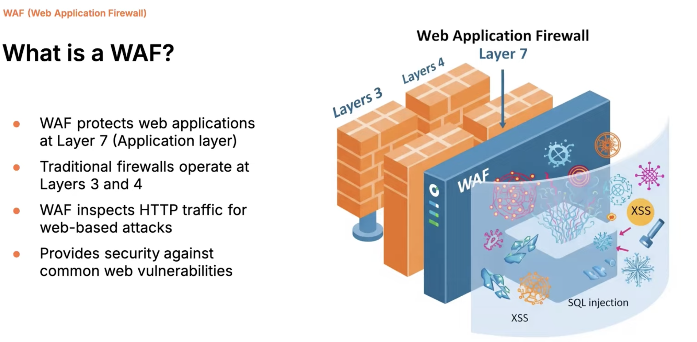
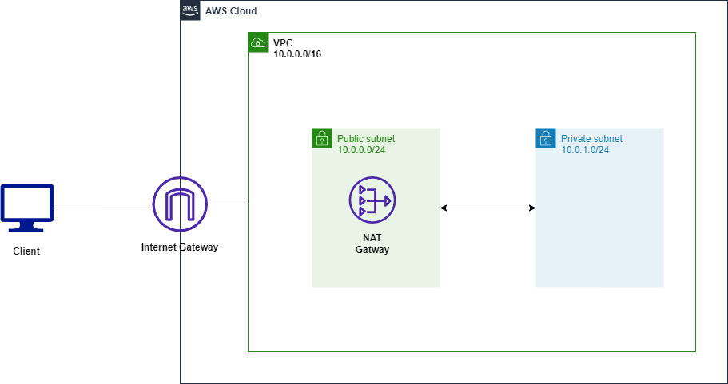
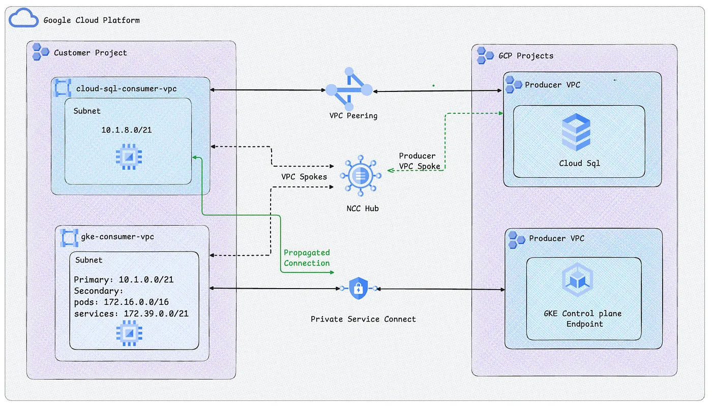

# hetzner-cloud
Scala-client for the Hetzner Cloud

This project uses Hetzner's OpenAPI spec for their Cloud API(`https://docs.hetzner.cloud/cloud.spec.json`) 
Using our Cloud API, you’re able to manage all cloud services and resources linked to them, such as Floatings IPs, Volumes and Load Balancers
`https://docs.hetzner.cloud/reference/cloud`


```json
  "mainPackage": "hcloud",
  "apiPackage": "hcloud.api",
  "modelPackage": "hcloud.models",
  "invokerPackage": ""
```
means 
hcloud
 - api
 - core
 - models

```json
  "mainPackage": "",
  "apiPackage": "hcloud.api",
  "modelPackage": "hcloud.models",
  "invokerPackage": "hcloud",

```
means 
hcloud
 - api
 - models

 
 `scala-sttp4-jsoniter` produces `sttp.client4.Request[Either[ResponseException[String], GetMultipleActionsResponse]]` for example which is just a description of the call

 `http4s-backend`	Backend	Actually sends requests using http4s client; produces SttpBackend[F, Any]
`sttp-fs2`	Streaming module	Adds support for fs2.Stream request/response bodies

### cats-effect-kernel
This is the low-level core of cats-effect.
It contains typeclasses and fundamental concurrency primitives, such as:
- Async
- Concurrent
- Spawn
- GenSpawn
- MonadCancel
- Clock
- Fiber
- Poll
- Outcome
- Typeclasses for resource safety
- Error handling structures

### cats-effect-std
This contains reusable concurrency utilities built on top of cats-effect.
It includes primitives and abstractions like:
```scala
import cats.effect.std.Console
import cats.effect.std.AtomicCell
import cats.effect.std.Backpressure
import cats.effect.std.Queue
import cats.effect.std.Semaphore
import cats.effect.std.QueueSink
import cats.effect.std.QueueSource
import cats.effect.std.Supervisor
import cats.effect.std.CountDownLatch
import cats.effect.std.CyclicBarrier
import cats.effect.std.Dequeue
import cats.effect.std.DequeueSink
import cats.effect.std.DequeueSource
import cats.effect.std.Dispatcher
import cats.effect.std.Random
import cats.effect.std.Hotswap
import cats.effect.std.MapRef
import cats.effect.std.Mutex
import cats.effect.std.PQueue
import cats.effect.std.PQueueSink
import cats.effect.std.PQueueSource
import cats.effect.std.UUIDGen
```
`cats-effect-std` depends on `cats-effect-kernel`

vRack is a proprietary private networking solution specific to OVHcloud.


It's designed to connect and isolate various OVHcloud services (Bare Metal servers, Public Cloud instances, Private Cloud, etc.) within a single, private Layer 2 network (VLANs).


OVHcloud's vRack private network technology offers a versatile solution for creating complex, secure and scalable network infrastructures. From basic private connectivity to multi-tenant private environments and public exposition of private services.

The OVHcloud vRack (virtual rack) allows multiple servers to be grouped together (regardless of number and physical location in our data centres) and connects them to a virtual switch within the same private network. Your servers can communicate privately and securely between each other, within a dedicated VLAN

### Cloud private networks
The vRack enables you to isolate your critical servers within a private VLAN. Your data is secure and communication between your servers is not routed via the public network.


### Multi-tenancy
The vRack is a private network that spreads across all OVHcloud locations, allowing you to build a highly available or distributed worldwide infrastructure for your applications, to the region of your choice.

Deploy up to 4000 private VLANs per vRack network to isolate your data even further in multi-tenant environments


### Cross Product
The vRack adapts to the needs of your business. Build your infrastructure using the products and services of our Bare Metal, Public Cloud or Private Cloud universes.


### Managed Services


### Hybrid Cloud


### Internet Gateway


```sh
  .dependsOn(`hcloud-codegen` % "compile->compile;test->test")
  ```
the above was causing the code generation to run for `sbt test`, which is not desired
```sh
# inspect Test / compile
[info] Dependencies:
[info]  Test / enableBinaryCompileAnalysis
[info]  Test / manipulateBytecode
[info]  Test / compileIncSetup
[info]  Test / managedFileStampCache
[info]  Test / fileConverter
[info]  Test / enableConsistentCompileAnalysis
[info] Reverse dependencies:
[info]  Test / discoveredMainClasses
[info]  Test / printWarnings
[info]  Test / definedTests
[info]  Test / compileEarly
[info]  Test / products
[info]  Test / tastyFiles
[info]  Test / bspBuildTargetCompileItem
[info]  Test / definedTestNames
[info]  Test / compileOutputs
[info] Delegates:
[info]  Test / compile
[info]  Runtime / compile
[info]  Compile / compile
[info]  compile
[info]  ThisBuild / Test / compile
[info]  ThisBuild / Runtime / compile
[info]  ThisBuild / Compile / compile
[info]  ThisBuild / compile
[info]  Zero / Test / compile
[info]  Zero / Runtime / compile
[info]  Zero / Compile / compile
[info]  Global / compile
[info] Related:
[info]  Compile / compile
[info]  hcloud-codegen / Compile / compile
[info]  hcloud-codegen / Test / compile
sbt:hetzner-cloud> 
```

In `hcloud-codegen` `(Compile / compile) := ((Compile / compile) dependsOn generate).value` causes `generate` run every time `Compile / compile` runs.

When you run sbt test in a project that depends on `hcloud-codegen` % `"...;test->test"`, sbt will trigger `hcloud-codegen/Test/compile` (because of that `test->test` mapping).

`Test / compile` depends on `Compile / compile` (sbt ensures the test classpath includes compiled main classes). Therefore `Compile / compile` runs, and because you made it depend on `generate`, the generator runs — even though you invoked `test`

So `test -> Test/compile -> Compile/compile -> generate` — hence the regeneration.


`https://www.cloudping.info/`

[using Hetzner and Cloudflare DNS](https://www.youtube.com/watch?v=E0tUio6ZgH8&t=29s)

[Hetzner and Cloudflare](https://www.youtube.com/watch?v=RK-IUOdwCBc&t=326s)


A VPC offers layer 3 network isolation.

Within each VPC, you can create multiple Private Networks and attach Scaleway resources to them, as long as the resources are in an AZ within the network’s region. Attached resources can then communicate between themselves in an isolated and secure layer 2 network, away from the public Internet.



VPC routing allows traffic to be routed throughout the VPC.

### vRouter
A vRouter is a virtualized router that sits inside a VPC and manages layer 3 routing between its resources. It holds the route table for the VPC. A VPC's vRouter is entirely managed by Scaleway, and not directly configurable by the user.



## Public connectivity over Private Networks
### Public Gateways
You can use Scaleway Public Gateways to provide resources on a Private Network with a secure point of access to and from the public internet.

- Set the `Public Gateway` to advertize a default route to the internet, allowing attached resources to send packets to the internet via the gateway, without needing their own public IP address.
- Activate the `SSH bastion` so that you can establish SSH connections to resources on the Private Network via the gateway's bastion.
- Use static NAT to map ingress traffic from the public internet towards resources on the Private Network, using private IP addresses and ports.






Azure firewall works at layer 4 while azure waf protects in layer 7




[Kubernetes in Hetzner Cloud with Terraform, Kubespray, HCLOUD Controller Manager and Storage Driver](https://www.youtube.com/watch?v=S424jkxtEf0)

```sh
-----BEGIN CERTIFICATE-----
(Your Primary SSL certificate)
-----END CERTIFICATE-----
-----BEGIN CERTIFICATE-----
(Your Intermediate certificate(s))
-----END CERTIFICATE-----
```


### Hetzner Cloud Controller Manager (hcloud-CCM)
The [hcloud-cloud-controller-manager](https://github.com/hetznercloud/hcloud-cloud-controller-manager) is the Kubernetes integration that allows a K8s cluster running on Hetzner Cloud to:
1. Manage cloud Load Balancers
When you create a Service `type=LoadBalancer`,
 - CCM creates a real Hetzner LB via the API
 - Assigns it to nodes
 - Creates target groups
 - Programs health checks
 - Updates LB rules when the K8s Service changes
 - It attaches the LB to a Hetzner Private Network if needed.

2. Manage Node addresses
When a node registers, CCM:
 - Inserts its public IPv4/IPv6
 - Inserts its private network IP (from your Hetzner network)
 - This allows pod-to-node routing and service endpoints to work correctly.

3. Configure Routes (if using the Hetzner CNI)
If using hcloud-cni (the official Hetzner CNI plugin):
 - Each node gets a Pod CIDR
 - CCM programs Hetzner Cloud Routes:
    - PodSubnet(node1) → via node1 private IP
    - PodSubnet(node2) → via node2 private IP
 - These routes are stored in the Hetzner VPC / Private Network object.
 - This creates native L3 routing inside the VPC without overlay tunnels.

When Kubernetes creates a LB for a Service:
- CCM creates a Load Balancer in Hetzner Cloud
- If your cluster uses a VPC/Network, CCM attaches the LB NIC to that network
- It brings the LB inside your private network so it can reach nodes privately

 Hetzner Private Networks are essentially L2 segments provided by Hetzner, implemented via:
- VLANs and/or VXLAN overlay inside their datacenter fabric
- DHCP options assigned to servers on attach
- Static IPs that you assign inside the network

Hetzner uses VXLAN only for node-to-node and node-to-LB traffic (L2 VPC)

In Kubernetes, the Cloud Controller Manager (CCM) is the component that connects Kubernetes to the cloud provider’s infrastructure.
It is the bridge between Kubernetes and the cloud.
Every cloud (AWS, GCP, Hetzner, DigitalOcean, etc.) provides its own CCM.

What the CCM does (high-level)
- The CCM is responsible for 4 major areas:
- Node Lifecycle Management
- Load Balancer Management
- Route / Network Management
- Persistent Volume (PV) Addressing (only for some clouds)

LoadBalancer Controller — creates cloud load balancers
Any time a Service of type:
`type: LoadBalancer`
is created, CCM:
Calls the cloud API
- Creates a real Load Balancer
- Configures listeners (ports, protocols)
- Adds Kubernetes nodes as LB targets
- Sets health checks
- Updates the Service with the LB’s IP

Expose Kubernetes services to the internet using the cloud’s load balancer infrastructure.

```sh
Kubernetes control plane components:
Component	            Purpose
API Server	          The “front door” to the cluster; all components talk to this
Controller Manager	  Runs controllers for core K8s resources 
Scheduler	            Decides which Node runs a Pod
etcd	                Persistent storage
Cloud Controller Manager (CCM)	Cloud provider integration (Nodes, LB, Routes)

```

Before Kubernetes 1.6, the architecture looked like this:
```sh
kube-controller-manager
   ├── node controller
   ├── route controller
   ├── service (LB) controller
   └── cloud provider integrations all embedded here
 ```  
Kubernetes introduced CCM so that cloud providers can:
- ship their own controller logic independently
- update without requiring Kubernetes releases
- avoid cloud-specific logic in core binaries
- support out-of-tree providers (e.g., Hetzner, DO, Linode, Scaleway)

`It communicates only with the API server and cloud APIs`

1. Add the Helm repo
```sh
helm repo add hcloud https://charts.hetzner.cloud
helm repo update
```

2. Step 2 — Install with your API token
```sh
helm install hcloud-cloud-controller-manager hcloud/hcloud-cloud-controller-manager \
  --namespace kube-system \
  --set secret.token=<YOUR_HCLOUD_API_TOKEN>
  ```
### Install using the raw YAML manifest (no Helm)
If you prefer to install manually:
Step 1 — Create a secret with your API token

`kubectl -n kube-system create secret generic hcloud --from-literal=token=<YOUR_TOKEN>`
2. Apply the CCM deployment manifests

`kubectl apply -f https://raw.githubusercontent.com/hetznercloud/hcloud-cloud-controller-manager/master/deploy/prod.yaml`


### Verifying installation
Check pods:
`kubectl get pods -n kube-system -l app=hcloud-cloud-controller-manager`

[kubernetes-on-hetzner](https://django.wtf/blog/kubernetes-on-hetzner/)

[hetznercloud](https://registry.terraform.io/providers/hetznercloud/hcloud/latest/docs)


```tf
resource "hcloud_server" "my_server" {
  name        = "server-%d"
  server_type = "cx23"
  image       = "ubuntu-24.04"
}

resource "hcloud_load_balancer" "load_balancer" {
  name               = "my-load-balancer"
  load_balancer_type = "lb11"
  location           = "nbg1"
}

resource "hcloud_load_balancer_target" "load_balancer_target" {
  type             = "server"
  load_balancer_id = hcloud_load_balancer.load_balancer.id
  server_id        = hcloud_server.my_server.id
}
```

CoreDNS is a system component in kubernetes
- It is a DNS server insider kubernetes
- it resolves internal DNS names(*.cluster.local) and external names

```sh
kubectl get pods -n kube-system
NAME                               READY   STATUS    RESTARTS      AGE
coredns-66bc5c9577-zzqdv           1/1     Running   1 (47h ago)   67d
etcd-minikube                      1/1     Running   1 (47h ago)   67d
kube-apiserver-minikube            1/1     Running   1 (47h ago)   67d
kube-controller-manager-minikube   1/1     Running   1 (47h ago)   67d
kube-proxy-696qh                   1/1     Running   1 (47h ago)   67d
kube-scheduler-minikube            1/1     Running   1 (47h ago)   67d
storage-provisioner                1/1     Running   7 (12h ago)   67d

```

```sh
kubectl get svc -n kube-system 
NAME       TYPE        CLUSTER-IP   EXTERNAL-IP   PORT(S)                  AGE
kube-dns   ClusterIP   10.96.0.10   <none>        53/UDP,53/TCP,9153/TCP   67d
```

Each pod has a unique ip address within the cluster and that ip address could be from the subnet if we are using the azure cni plugin or if not using  cni then it would be a podcidr

An overlay network defined within the aks cluster with its podcidr( if using kubenet or cni overlay)

Services get their ips from an overlay network allocated for it( service cidr)

So when we create a new aks cluster either using commandline,terraform, biceps etc, we should specify those different cidr ranges

- vnet cidr
- pod cidr
- service cidr

There should be no overlay between the pod cidr,service cidr and vnet cidr and if the vnet is peered,then all the ranges should not overlap


[IP Addressing & Subnetting, Avoid Overlapping IPs in VNets](https://www.youtube.com/watch?v=3ZD8kBS_OzM)

if the CIDR prefix is the same, the number of IP addresses is identical, regardless of what the starting IP is.
```sh
10.3.0.0/16
172.16.0.0/16
192.168.44.0/16
100.64.0.0/16
```
All have the exact same number of usable IP addresses.
A CIDR prefix like /16 means:
- First 16 bits of the address are fixed (network portion)
- Remaining 16 bits are available for hosts

Dokcer network MTU shuld always be equal to or smaller than the host MTU

192.168.0.0/16 => 192.168.0.0/17 and 192.168.128.0/17

198.19.0.0/16

[kubernetes-based-dev-environment-on-hetzner](https://oleg.smetan.in/posts/2025-04-15-kubernetes-based-dev-environment-on-hetzner)

Configure DNS in Cloudflare

To obtain valid TLS certificates for private services hosted internally (in the 10.0.0.0/16 network) and published at Internal Load Balancer, we have to use Let’s Encrypt DNS-01 challenge 
for certificate validation. This challenge asks you to prove that you control the DNS for your domain name by putting a specific value in a TXT record under that domain name. The most efficient and automated way to leverage the DNS-01 challenge is to use API-based DNS providers. Cert-manager supports various API-driven DNS providers , and in this guide, we will use Cloudflare DNS


```sh
## Create ClusterIssuer for Let’s Encrypt using Cloudflare DNS:
cat <<EOF | kubectl apply -f -
apiVersion: cert-manager.io/v1
kind: ClusterIssuer
metadata:
  name: letsencrypt-cloudflare
spec:
  acme:
    email: hi@yourcompany.com # CHANGEME!
    server: https://acme-v02.api.letsencrypt.org/directory
    privateKeySecretRef:
      name: letsencrypt-cloudflare
    solvers:
    - dns01:
        cloudflare:
          email: hi@yourcompany.com # CHANGEME!
          apiTokenSecretRef:
            name: cloudflare-dns
            key: api-token
EOF
```

``` https://grafana.int.yourcompany.com```


Create Cloudflare account and add your domain y`ourcompany.com` to it.
Configure Cloudflare DNS for the domain `yourcompany.com` and create A record for the domain `hello.yourcompany.com` pointing to the external IP address of the Public Load Balancer (public-lb).
```
Type: A
Name: hello
IPv4 address: <PUBLIC_LB_PUBLIC_IP>
Proxy status: Proxied
TTL: Auto
```
Configure Cloudflare DNS for the domain `yourcompany.com` and create A record for the domain `*.int.yourcompany.com` pointing to the internal(!) IP address of the Internal Load Balancer (internal-lb).

```sh
Type: A
Name: *.int
IPv4 address: 10.0.0.4
Proxy status: DNS only
TTL: Auto
```

## Why create DNS records in Cloudflare that point to internal IPs?
#### Your network still needs DNS resolution, even for internal services
Even if a service is only reachable inside your VPC/VNet/internal network, clients still need a DNS name to connect to it.
Example:

- Internal microservices
- Internal APIs
- Internal admin interfaces
- Internal-only apps behind VPN or private network peering
Clients inside your private environment may reference these services using FQDNs like:
- api.int.yourcompany.com
- service1.int.yourcompany.com

### Cloudflare is being used as the authoritative DNS source
If Cloudflare manages `yourcompany.com`, then:
All subdomains—including internal-only ones—must exist there
Otherwise, DNS queries for `*.int.yourcompany.com` will fail entirely
Even if actual connectivity to `10.x.x.x` is only possible from inside the network, Cloudflare still answers the DNS query.

### Proxying is disabled (“DNS Only”) → Cloudflare does NOT route traffic
This is why the guidance specifies:
`Proxy status: DNS only`

Meaning:
- Cloudflare does NOT sit between the client and the service
- Cloudflare does NOT forward traffic to your internal IP
- Cloudflare only returns the DNS answer

So, the internal IP never leaves your network—it only resolves for internal clients who can reach 10.0.0.4.
External users would resolve the DNS name but fail to connect (which is expected).

### Makes internal addressing consistent and predictable
Instead of using:
raw IPs
host files
separate private DNS servers
…the entire organization can rely on a predictable naming scheme:
- *.int.yourcompany.com → internal environment
- *.dev.yourcompany.com → staging
- *.yourcompany.com → public


When a client tries to resolve a domain (even an internal-only one like `service.int.yourcompany.com`), the DNS request eventually reaches Cloudflare because Cloudflare is the authoritative DNS provider for the entire domain `yourcompany.com`.

[self-hosted-wireguard-vpn](https://oleg.smetan.in/posts/2025-01-11-self-hosted-wireguard-vpn)

```sh
[Interface]
PrivateKey = yAnz5TF+lXXJte14tji3zlMNq+hd2rYUIgJBgB3fBmk=
ListenPort = 51820

[Peer]
PublicKey = xTIBA5rboUvnH4htodjb6e697QjLERt1NAB4mZqp8Dg=
Endpoint = 192.95.5.67:1234
AllowedIPs = 10.192.122.3/32, 10.192.124.1/24

[Peer]
PublicKey = TrMvSoP4jYQlY6RIzBgbssQqY3vxI2Pi+y71lOWWXX0=
Endpoint = [2607:5300:60:6b0::c05f:543]:2468
AllowedIPs = 10.192.122.4/32, 192.168.0.0/16

[Peer]
PublicKey = gN65BkIKy1eCE9pP1wdc8ROUtkHLF2PfAqYdyYBz6EA=
Endpoint = test.wireguard.com:18981
AllowedIPs = 10.10.10.230/32
```


A kubernetes ingress controller is designed to be the access point for HTTP and HTTPS traffic to the software running within your cluster. The ingress-nginx-controller does this by providing an HTTP proxy service supported by your cloud provider's load balancer.

[challenge-types](https://letsencrypt.org/docs/challenge-types/#dns-01-challenge)

### DNS providers who easily integrate with Let’s Encrypt DNS validation

Name(Free)   ACME clients
- cloudflare certbot,acme.sh ,lego and others
- ovh certbot,acme.sh and others
- digital ocean certbot,acme.sh,lego and others
- vultr. acme.sh,lego and others
- hetzner lego,posh-acme and others

[terraform-provisioning-hetzner](https://oghabi.it/blog/cloud-infrastructure-series/terraform-provisioning-hetzner/)

10.2.0.0/16. range 10.2.0.2-10.2.255.254. gateway 10.2.0.1
10.3.0.0/16 range 10.3.0.2- 10.3.255.254 gateway 10.3.0.1

### Management Network (10.0.0.0/16)
The management network hosts the core infrastructure. I designed IP allocation with room for future growth:

Network: 10.0.0.0/16 (65,534 available hosts)
```sh
Subnet allocation:
- 10.0.0.0/24    Infrastructure core (254 hosts)
  ├─ 10.0.0.1    Gateway (reserved)
  ├─ 10.0.0.2    Bastion host (NAT + Jump + VPN)
  ├─ 10.0.0.3    Reserved (future HA bastion)
  ├─ 10.0.0.4    Rancher management cluster
  ├─ 10.0.0.5    Vault server (secrets management)
  ├─ 10.0.0.6    ArgoCD (GitOps)
  └─ 10.0.0.7-10 Reserved for future services

- 10.0.1.0/24    Rancher worker nodes
- 10.0.2.0/24    Monitoring stack (Prometheus, Grafana, Loki)
- 10.0.3.0/24    CI/CD infrastructure
- 10.0.10.0/24+  Reserved for expansion (room for ~240 subnets)
```            

    Intra-VPC traffic stays local: Must never exit and re-enter
    Internet traffic always goes through NAT gateway: Centralized control

Routing Table: Management Network

```sh
Destination         Next Hop              Priority    Note
10.0.0.0/16        Local                 1           Intra-VPC (higher priority)
0.0.0.0/0          10.0.0.2 (Bastion)    2           Default route via NAT
 ```           
Priority is fundamental: the more specific route (10.0.0.0/16) has priority over the default (0.0.0.0/0). This ensures that a VM wanting to talk to another VM in the same VPC never goes through the bastion.

### Bastion Host Configuration
The bastion is configured as a dual-homed host (two network interfaces):

```sh
eth0 (Public interface):
  - Hetzner public IP
  - Default gateway to internet
  - Exposed to internet (SSH + WireGuard only)

eth1 (Private interface):
  - IP: 10.0.0.2
  - Connected to management VPC
  - Not reachable from internet

Kernel configuration:
  net.ipv4.ip_forward = 1

iptables configuration:
  # NAT for traffic from VPC to internet
  iptables -t nat -A POSTROUTING -s 10.0.0.0/16 -o eth0 -j MASQUERADE

  # Allow forwarding from VPC to internet
  iptables -A FORWARD -i eth1 -o eth0 -j ACCEPT
  iptables -A FORWARD -i eth0 -o eth1 -m state --state RELATED,ESTABLISHED -j ACCEPT

  # Block unsolicited connections from internet to VPC
  iptables -A FORWARD -i eth0 -o eth1 -j DROP
 ```           

How NAT works: When a private VM (e.g., 10.0.0.4) wants to reach the internet (e.g., 8.8.8.8), the packet arrives at the bastion which applies SNAT (Source NAT), replacing the source IP with its own public IP. It maintains a connection tracking table to know where to send replies back. It's completely transparent to VMs. 

No need for cloud-managed NAT gateways
This is the same pattern used in AWS, GCP, Azure, etc., but implemented manually since this is Hetzner.

[multi-tenant-cloud-infrastructure-architecture](https://oghabi.it/blog/multi-tenant-cloud-infrastructure-architecture/)

An IP + /32 means “match exactly this single host”

256 /24 networks fit inside a /16.

IAM (Keycloak),building scalable APIs and cloud‑native architectures with a strong focus on security 

Terraform is more geared to maintaining a Cloud infrastructure, "in the large": acquiring VM-instances, networks, DNS. If you are familiar with AWS, Google Cloud Platform, or in our case Hetzner Cloud , it is what you can do by clicking in their respective UIs or via their APIs like Hetzner's hcloud 

`"Terraform is designed to provision different infrastructure components. Ansible is a configuration-management and application-deployment tool. It means that you'll use Terraform first to create, for example, a virtual machine and then use Ansible to install necessary applications on that machine."`

If your workloads run entirely inside Kubernetes, then Kubernetes itself acts as:
- the orchestration layer
- the deployment system
- the configuration manager (via ConfigMaps, Secrets, CRDs, - Operators)
- the self-healing mechanism
In this model, you typically use:
- Terraform → to provision the cluster (EKS, AKS, GKE, etc.)
- Helm / Kustomize / GitOps tools (Argo CD, Flux) → to deploy and configure applications inside the cluster

Managing Kubernetes nodes (if you self-host clusters)
If you run Kubernetes on bare metal or your own VMs (not managed services), Ansible can help:
- install container runtime
- configure Linux dependencies
- set up kubeadm-based clusters
Many bare-metal Kubernetes deployments use Ansible + kubeadm.

`ingress` is l7 http routing

kube-proxy is the implementation of the service api
it runs on every node in the cluster and uses the node as a proxy for traffic from pods on that node

Services are how you expose l4 load balancer

each path in ingress map to a particular service

ingress is different from service loadbalancer in that a service lb api does not provide for http;no hostnames,no paths,no tls etc



### High Availability & Reliability
- Load Balancers: Deploy Load Balancers to distribute incoming traffic across multiple targets. You can configure health checks (HTTP or TCP) to ensure traffic is only routed to healthy resources
- Volumes: For persistent data, use Volumes. These are SSD-based block storage designed to be highly available and scalable

### Networking & Connectivity
- Private Networks: Use the Networks feature to enable servers to communicate over dedicated private interfaces. This traffic is not available publicly and supports RFC1918 private IP ranges.
- Subnets: Divide your network's IP range into subnets
- Primary IPs: While every server needs a network interface, you can manage Primary IPs (IPv4 and IPv6) to gain more flexibility in how your servers are addressed and moved between resources


### Security Best Practices

- Firewalls: Implement Firewalls to restrict inbound and outbound traffic. By default, firewalls with no inbound rules will drop all traffic, providing a "deny-all" security posture.
- SSH Keys: Always use SSH keys instead of passwords for server access to enhance security. These can be injected into servers at the time of creation.
- Certificates: Use TLS/SSL certificates to encrypt client traffic. The API supports both managed certificates (automatically issued/renewed) and uploaded certificates.
- Resource Protection: Enable deletion protection for critical resources like Images and Volumes to prevent accidental data loss or service disruption.

In a production-grade architecture, certificates are rarely used in isolation. They are typically attached to Load Balancer listeners to terminate SSL/TLS traffic.

In a production environment, manually applying firewalls to every new server is error-prone. Instead, use Label Selectors

Delete Protection: Immediately after creation, call changeLoadBalancerProtection with delete = true. This prevents the deleteLoadBalancer method from executing unless protection is manually removed first

[How to setup a Hetzner K3s Cluster with Traefik SSL](https://www.youtube.com/watch?v=NpLVcHscDXk&t=111s)


a routing table entry: `Destination: 192.168.128.0, Mask: 255.255.128.0, Next Hop: [Interface/IP]`.

No Parent Needed: The router doesn't care if this block was carved out of a larger `192.168.0.0/16` range or not. It only needs to know that any packet destined for an IP between `192.168.128.0` and `192.168.255.255` should be forwarded according to this specific entry.

`The transition from Classful subnetting to CIDR was really about the move to VLSM (Variable Length Subnet Masking).`
- If you divided your Class B into /24s, every subnet had to be a /24.
- If you had a tiny branch office with only 2 computers, you still had to waste a whole /24 (254 addresses) on them because you couldn't mix and match mask lengths.

CIDR allowed "Variable Length" masks.
- You can have one /17 for your main headquarters.
- A /24 for a medium office.
- A /30 (only 2 usable IPs) for a single point-to-point link between routers.
- All within the same address space.

`CIDR introduced Route Summarization (Supernetting)`
Because CIDR doesn't care about classes, an ISP can take 1,000 small customer networks and tell the rest of the internet: "Just send everything starting with 192.168.0.0/16 to me."

The reason CIDR (Classless) was such a big deal is that it allowed Supernetting (moving the mask to the left) and VLSM (Variable Length Subnet Masking)

```sh
Decimal,Binary (2nd Octet)
172.16,10101100.00010000
172.31,10101100.00011111
```
The first 12 bits of the entire IP address (all of the 1st octet and the first 4 bits of the 2nd octet) stay exactly the same: `10101100.0001`. This is why the CIDR is /12.

If the "locked" part is `0001`, what is the biggest number you can make by changing the remaining 4 bits in that octet?
- Result: 00011111
- In decimal, 00011111 is 31.

This is a single /8 block. If we slice it into standard /24 networks:
- Calculation: 24−8=16 bits for subnetting.
- Total Networks: 216= 65,536 networks (each with 254 usable IPs).

Because this range is exactly a /8, it is considered one single Class A network.

172.16.0.0/12 Range
2^(16−12)=2^4= 16 networks.`These are 172.16.x.x,172.17.x.x,…,172.31.x.x.`


A standard Class C is a /24. Since the private range is a /16, it is a "Supernet" made of many Class C networks.
- As Class B networks (/16): It is one single Class B-sized block.
- As Class C networks (/24): 2^(24−16)=2^8= 256 networks.

These are `192.168.0.x,192.168.1.x,…,192.168.255.x`





### Generate ssh-keys for servers

Generate a new SSH keys in your terminal called `id_hetzner_entrance and id_hetzner_nodes`. The argument provided with the -f flag creates the key in the current directory and creates four files called `id_hetzner_entrance, id_hetzner_entrance.pub and id_hetzner_nodes, id_hetzner_nodes`.pub. Change the placeholder email address to your email address.

### Generate ssh-key for entrance server

`ssh-keygen -t ed25519 -C "your_email@example.com" -f ~/.ssh/id_hetzner_entrance`

### Generate ssh-key for internal connections

`ssh-keygen -t ed25519 -C "your_email@example.com" -f ~/.ssh/id_hetzner_nodes`

AWS VPC spans a region
subnets are allocated as a subset of the VPC ipv4 or IPV6 CIDR range and span a specific AZ

you can have up to 200 subnets per VPC 

implicit route between all subnets within a VPC

subnets are public subnets when there is a route to an internet gateway

you can have multiple subnets in an AZ but one subnet will not span  more than one AZ

A network access control list(ACL) allows or denies specific inbound or outbound traffic at the subnet level

A route table contains a set of rules called routes, that determine where network trafic from your subent is directed

- Each subnet has associated routing table
- Routing tables can be associated with multiple subnets
- 50 routes per route table by default
- subnets are referred to as "public subnets" when there is a route to an internet gateway

Route tables point to :
- internet gateway or NAT gateway
- Gateway endpoint
- VPC peering/AWS Transit Gateway
- VPN Gateway/ direct Connect

In production, your databases and application servers should never have public IP addresses. You reach them via a Bastion/VPN host

### Zero-Trust Access via SSH CA
Instead of hardcoding individual SSH keys for every developer (which is a security nightmare), advanced teams use a Single Sign-On (SSO) or SSH Certificate Authority.

```scala
object LoadBalancerServiceEnums:
  enum Protocol:
    case `http`
    case `https`
    case `tcp`

```
choosing between TCP, HTTP, and HTTPS determines at which layer of the networking stack your Load Balancer (LB) operates.

The primary distinction is between Layer 4 (Transport) and Layer 7 (Application).

In a production environment, choosing between TCP, HTTP, and HTTPS determines at which layer of the networking stack your Load Balancer (LB) operates. This decision changes how much the LB "knows" about the traffic passing through it.
🛠️ The Core Difference: OSI Layers

The primary distinction is between Layer 4 (Transport) and Layer 7 (Application).

1. tcp (Layer 4 - Transport)
At this level, the Load Balancer is "blind." It only sees the IP address and the Port.
- How it works: It receives a packet and immediately forwards it to a target server without looking at what's inside.
- Pros: Extremely fast, low latency, and handles any protocol (not just web traffic).
- Cons: Cannot read cookies, cannot see the URL path, and cannot handle SSL certificates.
- Best for: Databases (PostgreSQL/Redis), Mail servers, or when you want your application servers to handle their own SSL.

2. http (Layer 7 - Application)
At this level, the Load Balancer is "smart." It "unpacks" the traffic to see the actual content.
- How it works: It can read HTTP Headers, Cookies, and the URL path.
- Pros: Allows for "Path-based routing" (e.g., sending example.com/api to one server and example.com/images to another). It also enables Sticky Sessions using cookies.
- Cons: Slightly higher latency because it has to inspect every packet.
- Best for: Standard web applications where you need intelligent routing or session persistence.

3. https (Layer 7 - Application + Security)
This is http with SSL/TLS Termination.
- How it works: The Load Balancer holds your SSL Certificate. It decrypts the incoming traffic, inspects it (like the HTTP mode), and then sends it to your servers (usually as plain HTTP over the private network).
- Pros: Offloads the heavy work of encryption/decryption from your web servers, making them faster. It also centralizes certificate management.
- Cons: Requires managing certificates on the Load Balancer.
- Best for: Any production website.

```scala
 enum Protocol:
    case `esp` //Encapsulating Security Payload)//Building Site-to-Site VPNs or connecting a local office network to your Hetzner VPC.
    case `gre` //Generic Routing Encapsulation
    case `icmp`
    case `tcp`
    case `udp`

```
these protocols define how the firewall inspects and filters packets at the Network (Layer 3) and Transport (Layer 4) levels of the OSI model    

```sh
Public (DMZ)	10.0.1.0/24	254	Load Balancers, Bastion Hosts, NAT Gateways.
Private (App)	10.0.10.0/22	1,022	Kubernetes Workers, API Servers, Microservices.
Database (Data)	10.0.20.0/24	254	PostgreSQL, Redis, Managed Databases.
Management	10.0.254.0/24	254	Monitoring (Prometheus), Logging, VPN access.
```

A single production Load Balancer often runs multiple services simultaneously. For example:

- Service A (HTTP Redirect): Listens on port 80 just to tell users to go to port 443.
- Service B (HTTPS App): Listens on port 443 for the actual website traffic.
- Service C (API): Listens on port 8443 for a specific mobile API.

Service: The rule/configuration (Protocol + Port).
Target: The actual server (VM) that receives the traffic.

In a real production environment, manually listing Server IDs is considered "brittle." If you add a new worker node, you have to remember to update the firewall attachment.

```scala
object LoadBalancerTargetEnums:
  enum Type:
    case `ip`
    case `label_selector`
    case `server`
```
Instead, production setups use Label Selectors. You tell the Firewall: "Apply these rules to any server that has the label app=kubernetes."


In a production environment, a Label Selector is the secret to building "Self-Healing" and "Auto-Scaling" infrastructure.
Instead of manually telling the Load Balancer exactly which Server ID to send traffic to (which is fragile), you give the Load Balancer a Search Query.

You created one Layer-3 routed private network.
Inside that network, all subnets (like 10.0.1.0/24, 10.0.9.0/24, etc.) are:
- automatically routed toward each other
- automatically reachable
- NOT isolated

- to generate a new ssh key, run ` ssh-keygen -t ed25519 -C "youremailaddress" and enter a passphrase when prompted
- copy your ssh public key to your hetzner server
`cat .ssh/vps_tutorial | pbcopy`
- add your key to the ssh agent `ssh add ~/.ssh/vps_tutorial` and enter passphrase


- `Allow Cloudflare IPs for tunnel (egress only, no ingress needed)`
- cloudflared establishes outbound connections