# hetzner-cloud
Scala-client for the Hetzner Cloud

This project uses Hetzner's OpenAPI spec for their Cloud API(`https://docs.hetzner.cloud/cloud.spec.json`) 
Using our Cloud API, you’re able to manage all cloud services and resources linked to them, such as Floatings IPs, Volumes and Load Balancers
`https://docs.hetzner.cloud/reference/cloud`


```json
  "mainPackage": "hcloud",
  "apiPackage": "hcloud.api",
  "modelPackage": "hcloud.models",
  "invokerPackage": ""
```
means 
hcloud
 - api
 - core
 - models

```json
  "mainPackage": "",
  "apiPackage": "hcloud.api",
  "modelPackage": "hcloud.models",
  "invokerPackage": "hcloud",

```
means 
hcloud
 - api
 - models

 
 `scala-sttp4-jsoniter` produces `sttp.client4.Request[Either[ResponseException[String], GetMultipleActionsResponse]]` for example which is just a description of the call

 `http4s-backend`	Backend	Actually sends requests using http4s client; produces SttpBackend[F, Any]
`sttp-fs2`	Streaming module	Adds support for fs2.Stream request/response bodies

### cats-effect-kernel
This is the low-level core of cats-effect.
It contains typeclasses and fundamental concurrency primitives, such as:
- Async
- Concurrent
- Spawn
- GenSpawn
- MonadCancel
- Clock
- Fiber
- Poll
- Outcome
- Typeclasses for resource safety
- Error handling structures

### cats-effect-std
This contains reusable concurrency utilities built on top of cats-effect.
It includes primitives and abstractions like:
```scala
import cats.effect.std.Console
import cats.effect.std.AtomicCell
import cats.effect.std.Backpressure
import cats.effect.std.Queue
import cats.effect.std.Semaphore
import cats.effect.std.QueueSink
import cats.effect.std.QueueSource
import cats.effect.std.Supervisor
import cats.effect.std.CountDownLatch
import cats.effect.std.CyclicBarrier
import cats.effect.std.Dequeue
import cats.effect.std.DequeueSink
import cats.effect.std.DequeueSource
import cats.effect.std.Dispatcher
import cats.effect.std.Random
import cats.effect.std.Hotswap
import cats.effect.std.MapRef
import cats.effect.std.Mutex
import cats.effect.std.PQueue
import cats.effect.std.PQueueSink
import cats.effect.std.PQueueSource
import cats.effect.std.UUIDGen
```
`cats-effect-std` depends on `cats-effect-kernel`

vRack is a proprietary private networking solution specific to OVHcloud.


It's designed to connect and isolate various OVHcloud services (Bare Metal servers, Public Cloud instances, Private Cloud, etc.) within a single, private Layer 2 network (VLANs).


OVHcloud's vRack private network technology offers a versatile solution for creating complex, secure and scalable network infrastructures. From basic private connectivity to multi-tenant private environments and public exposition of private services.

The OVHcloud vRack (virtual rack) allows multiple servers to be grouped together (regardless of number and physical location in our data centres) and connects them to a virtual switch within the same private network. Your servers can communicate privately and securely between each other, within a dedicated VLAN

### Cloud private networks
The vRack enables you to isolate your critical servers within a private VLAN. Your data is secure and communication between your servers is not routed via the public network.

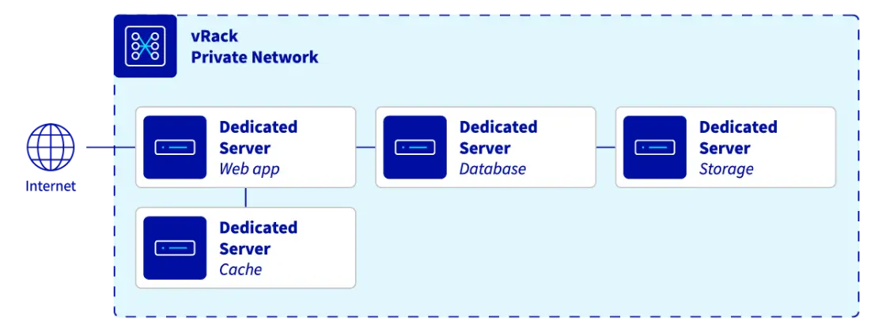

### Multi-tenancy
The vRack is a private network that spreads across all OVHcloud locations, allowing you to build a highly available or distributed worldwide infrastructure for your applications, to the region of your choice.

Deploy up to 4000 private VLANs per vRack network to isolate your data even further in multi-tenant environments
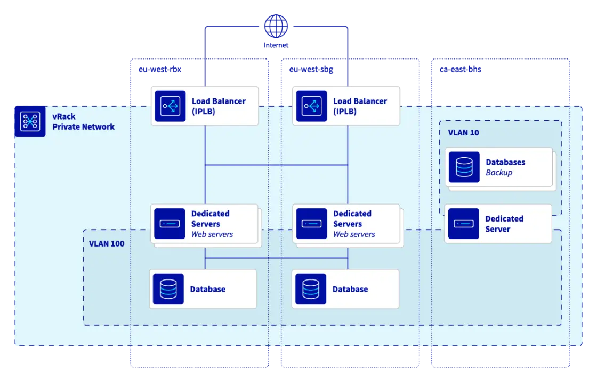

### Cross Product
The vRack adapts to the needs of your business. Build your infrastructure using the products and services of our Bare Metal, Public Cloud or Private Cloud universes.
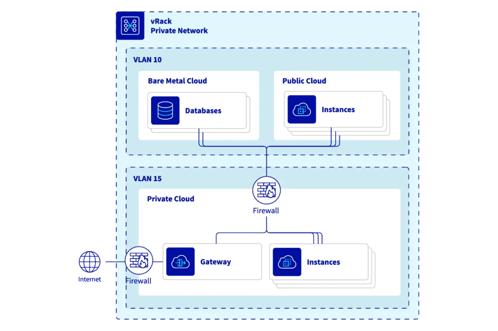

### Managed Services
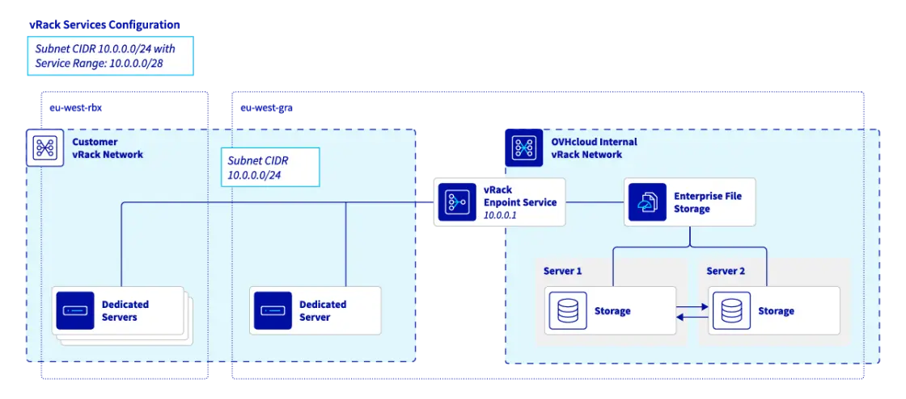

### Hybrid Cloud
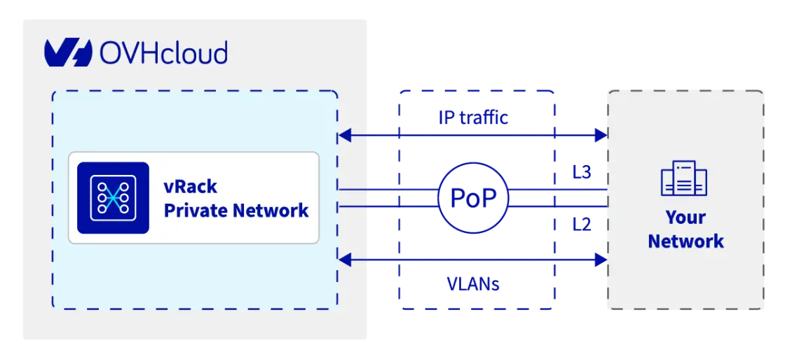

### Internet Gateway
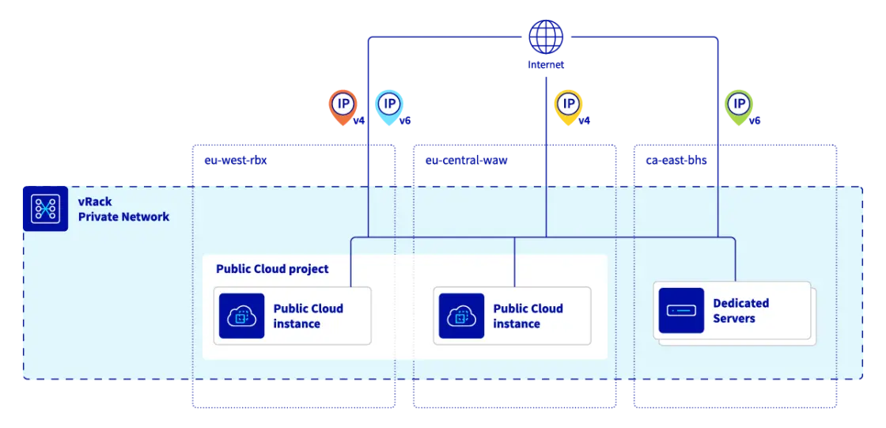

```sh
  .dependsOn(`hcloud-codegen` % "compile->compile;test->test")
  ```
the above was causing the code generation to run for `sbt test`, which is not desired
```sh
# inspect Test / compile
[info] Dependencies:
[info]  Test / enableBinaryCompileAnalysis
[info]  Test / manipulateBytecode
[info]  Test / compileIncSetup
[info]  Test / managedFileStampCache
[info]  Test / fileConverter
[info]  Test / enableConsistentCompileAnalysis
[info] Reverse dependencies:
[info]  Test / discoveredMainClasses
[info]  Test / printWarnings
[info]  Test / definedTests
[info]  Test / compileEarly
[info]  Test / products
[info]  Test / tastyFiles
[info]  Test / bspBuildTargetCompileItem
[info]  Test / definedTestNames
[info]  Test / compileOutputs
[info] Delegates:
[info]  Test / compile
[info]  Runtime / compile
[info]  Compile / compile
[info]  compile
[info]  ThisBuild / Test / compile
[info]  ThisBuild / Runtime / compile
[info]  ThisBuild / Compile / compile
[info]  ThisBuild / compile
[info]  Zero / Test / compile
[info]  Zero / Runtime / compile
[info]  Zero / Compile / compile
[info]  Global / compile
[info] Related:
[info]  Compile / compile
[info]  hcloud-codegen / Compile / compile
[info]  hcloud-codegen / Test / compile
sbt:hetzner-cloud> 
```

In `hcloud-codegen` `(Compile / compile) := ((Compile / compile) dependsOn generate).value` causes `generate` run every time `Compile / compile` runs.

When you run sbt test in a project that depends on `hcloud-codegen` % `"...;test->test"`, sbt will trigger `hcloud-codegen/Test/compile` (because of that `test->test` mapping).

`Test / compile` depends on `Compile / compile` (sbt ensures the test classpath includes compiled main classes). Therefore `Compile / compile` runs, and because you made it depend on `generate`, the generator runs — even though you invoked `test`

So `test -> Test/compile -> Compile/compile -> generate` — hence the regeneration.


`https://www.cloudping.info/`

[using Hetzner and Cloudflare DNS](https://www.youtube.com/watch?v=E0tUio6ZgH8&t=29s)

[Hetzner and Cloudflare](https://www.youtube.com/watch?v=RK-IUOdwCBc&t=326s)


A VPC offers layer 3 network isolation.

Within each VPC, you can create multiple Private Networks and attach Scaleway resources to them, as long as the resources are in an AZ within the network’s region. Attached resources can then communicate between themselves in an isolated and secure layer 2 network, away from the public Internet.

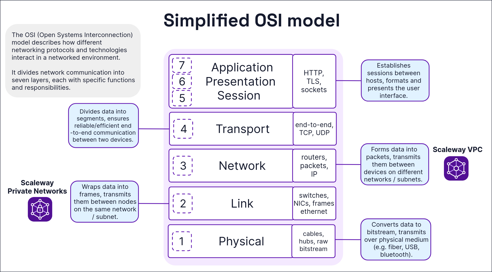

VPC routing allows traffic to be routed throughout the VPC.

### vRouter
A vRouter is a virtualized router that sits inside a VPC and manages layer 3 routing between its resources. It holds the route table for the VPC. A VPC's vRouter is entirely managed by Scaleway, and not directly configurable by the user.

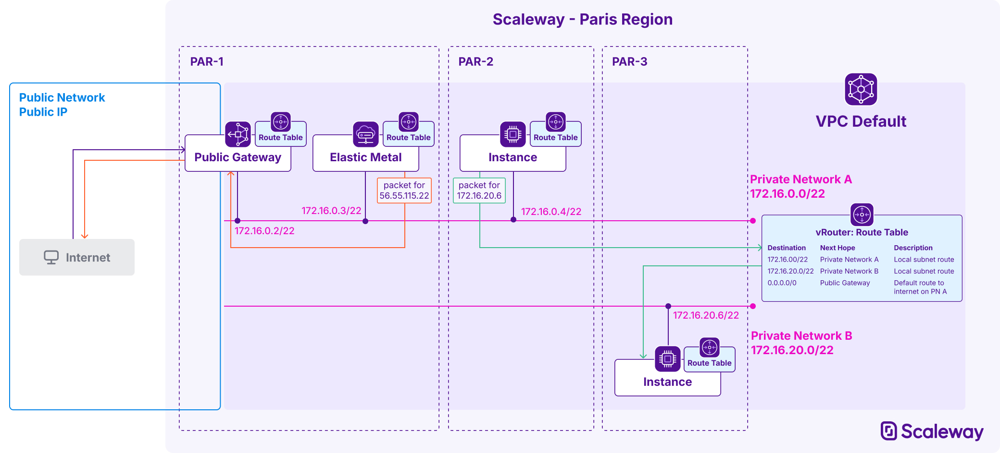

## Public connectivity over Private Networks
### Public Gateways
You can use Scaleway Public Gateways to provide resources on a Private Network with a secure point of access to and from the public internet.

- Set the `Public Gateway` to advertize a default route to the internet, allowing attached resources to send packets to the internet via the gateway, without needing their own public IP address.
- Activate the `SSH bastion` so that you can establish SSH connections to resources on the Private Network via the gateway's bastion.
- Use static NAT to map ingress traffic from the public internet towards resources on the Private Network, using private IP addresses and ports.

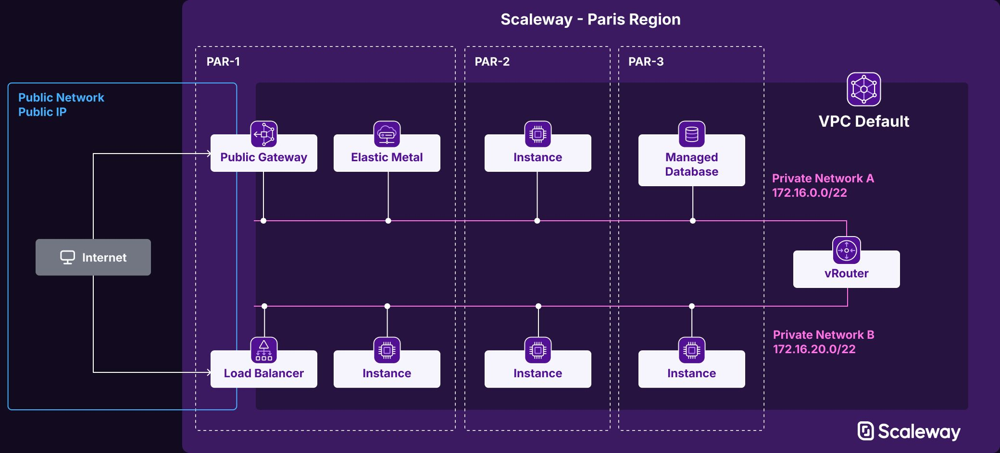


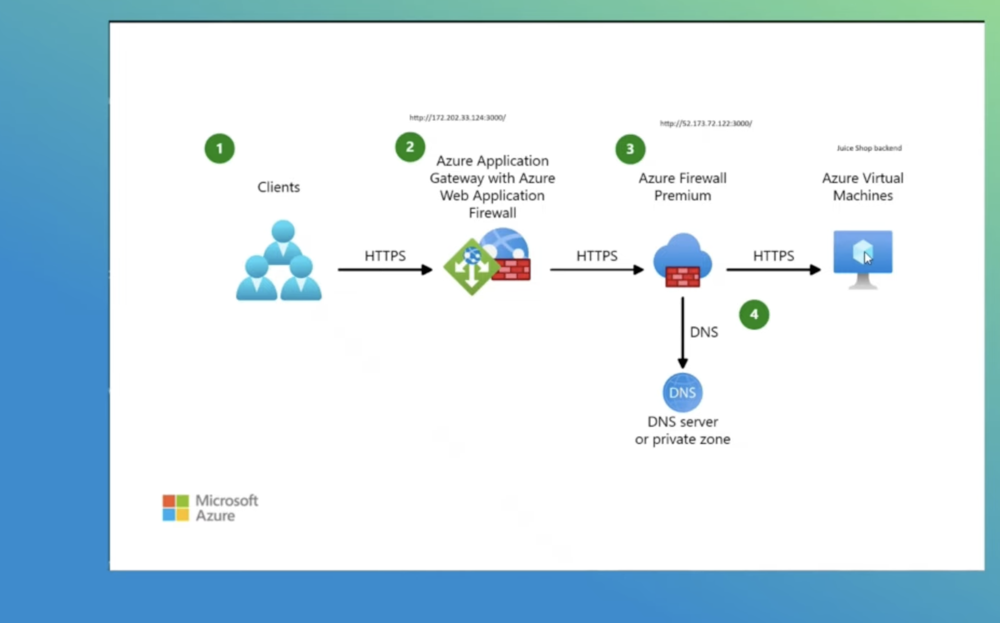

Azure firewall works at layer 4 while azure waf protects in layer 7

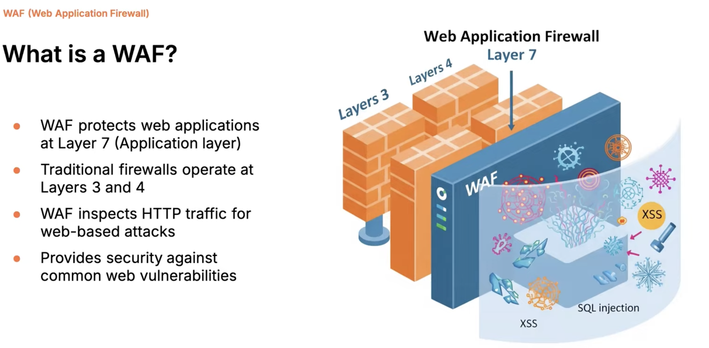

[Kubernetes in Hetzner Cloud with Terraform, Kubespray, HCLOUD Controller Manager and Storage Driver](https://www.youtube.com/watch?v=S424jkxtEf0)

```sh
-----BEGIN CERTIFICATE-----
(Your Primary SSL certificate)
-----END CERTIFICATE-----
-----BEGIN CERTIFICATE-----
(Your Intermediate certificate(s))
-----END CERTIFICATE-----
```

### Hetzner Cloud Controller Manager (hcloud-CCM)
The [hcloud-cloud-controller-manager](https://github.com/hetznercloud/hcloud-cloud-controller-manager) is the Kubernetes integration that allows a K8s cluster running on Hetzner Cloud to:
1. Manage cloud Load Balancers
When you create a Service `type=LoadBalancer`,
 - CCM creates a real Hetzner LB via the API
 - Assigns it to nodes
 - Creates target groups
 - Programs health checks
 - Updates LB rules when the K8s Service changes
 - It attaches the LB to a Hetzner Private Network if needed.

2. Manage Node addresses
When a node registers, CCM:
 - Inserts its public IPv4/IPv6
 - Inserts its private network IP (from your Hetzner network)
 - This allows pod-to-node routing and service endpoints to work correctly.

3. Configure Routes (if using the Hetzner CNI)
If using hcloud-cni (the official Hetzner CNI plugin):
 - Each node gets a Pod CIDR
 - CCM programs Hetzner Cloud Routes:
    - PodSubnet(node1) → via node1 private IP
    - PodSubnet(node2) → via node2 private IP
 - These routes are stored in the Hetzner VPC / Private Network object.
 - This creates native L3 routing inside the VPC without overlay tunnels.

When Kubernetes creates a LB for a Service:
- CCM creates a Load Balancer in Hetzner Cloud
- If your cluster uses a VPC/Network, CCM attaches the LB NIC to that network
- It brings the LB inside your private network so it can reach nodes privately

 Hetzner Private Networks are essentially L2 segments provided by Hetzner, implemented via:
- VLANs and/or VXLAN overlay inside their datacenter fabric
- DHCP options assigned to servers on attach
- Static IPs that you assign inside the network

Hetzner uses VXLAN only for node-to-node and node-to-LB traffic (L2 VPC)

In Kubernetes, the Cloud Controller Manager (CCM) is the component that connects Kubernetes to the cloud provider’s infrastructure.
It is the bridge between Kubernetes and the cloud.
Every cloud (AWS, GCP, Hetzner, DigitalOcean, etc.) provides its own CCM.

What the CCM does (high-level)
- The CCM is responsible for 4 major areas:
- Node Lifecycle Management
- Load Balancer Management
- Route / Network Management
- Persistent Volume (PV) Addressing (only for some clouds)

LoadBalancer Controller — creates cloud load balancers
Any time a Service of type:
`type: LoadBalancer`
is created, CCM:
Calls the cloud API
- Creates a real Load Balancer
- Configures listeners (ports, protocols)
- Adds Kubernetes nodes as LB targets
- Sets health checks
- Updates the Service with the LB’s IP

Expose Kubernetes services to the internet using the cloud’s load balancer infrastructure.

```sh
Kubernetes control plane components:
Component	            Purpose
API Server	          The “front door” to the cluster; all components talk to this
Controller Manager	  Runs controllers for core K8s resources 
Scheduler	            Decides which Node runs a Pod
etcd	                Persistent storage
Cloud Controller Manager (CCM)	Cloud provider integration (Nodes, LB, Routes)

```

Before Kubernetes 1.6, the architecture looked like this:
```sh
kube-controller-manager
   ├── node controller
   ├── route controller
   ├── service (LB) controller
   └── cloud provider integrations all embedded here
 ```  
Kubernetes introduced CCM so that cloud providers can:
- ship their own controller logic independently
- update without requiring Kubernetes releases
- avoid cloud-specific logic in core binaries
- support out-of-tree providers (e.g., Hetzner, DO, Linode, Scaleway)

`It communicates only with the API server and cloud APIs`

1. Add the Helm repo
```sh
helm repo add hcloud https://charts.hetzner.cloud
helm repo update
```

2. Step 2 — Install with your API token
```sh
helm install hcloud-cloud-controller-manager hcloud/hcloud-cloud-controller-manager \
  --namespace kube-system \
  --set secret.token=<YOUR_HCLOUD_API_TOKEN>
  ```
### Install using the raw YAML manifest (no Helm)
If you prefer to install manually:
Step 1 — Create a secret with your API token

`kubectl -n kube-system create secret generic hcloud --from-literal=token=<YOUR_TOKEN>`
2. Apply the CCM deployment manifests

`kubectl apply -f https://raw.githubusercontent.com/hetznercloud/hcloud-cloud-controller-manager/master/deploy/prod.yaml`


### Verifying installation
Check pods:
`kubectl get pods -n kube-system -l app=hcloud-cloud-controller-manager`

[kubernetes-on-hetzner](https://django.wtf/blog/kubernetes-on-hetzner/)

[hetznercloud](https://registry.terraform.io/providers/hetznercloud/hcloud/latest/docs)


```tf
resource "hcloud_server" "my_server" {
  name        = "server-%d"
  server_type = "cx23"
  image       = "ubuntu-24.04"
}

resource "hcloud_load_balancer" "load_balancer" {
  name               = "my-load-balancer"
  load_balancer_type = "lb11"
  location           = "nbg1"
}

resource "hcloud_load_balancer_target" "load_balancer_target" {
  type             = "server"
  load_balancer_id = hcloud_load_balancer.load_balancer.id
  server_id        = hcloud_server.my_server.id
}
```

CoreDNS is a system component in kubernetes
- It is a DNS server insider kubernetes
- it resolves internal DNS names(*.cluster.local) and external names

```sh
kubectl get pods -n kube-system
NAME                               READY   STATUS    RESTARTS      AGE
coredns-66bc5c9577-zzqdv           1/1     Running   1 (47h ago)   67d
etcd-minikube                      1/1     Running   1 (47h ago)   67d
kube-apiserver-minikube            1/1     Running   1 (47h ago)   67d
kube-controller-manager-minikube   1/1     Running   1 (47h ago)   67d
kube-proxy-696qh                   1/1     Running   1 (47h ago)   67d
kube-scheduler-minikube            1/1     Running   1 (47h ago)   67d
storage-provisioner                1/1     Running   7 (12h ago)   67d

```

```sh
kubectl get svc -n kube-system 
NAME       TYPE        CLUSTER-IP   EXTERNAL-IP   PORT(S)                  AGE
kube-dns   ClusterIP   10.96.0.10   <none>        53/UDP,53/TCP,9153/TCP   67d
```

Each pod has a unique ip address within the cluster and that ip address could be from the subnet if we are using the azure cni plugin or if not using  cni then it would be a podcidr

An overlay network defined within the aks cluster with its podcidr( if using kubenet or cni overlay)

Services get their ips from an overlay network allocated for it( service cidr)

So when we create a new aks cluster either using commandline,terraform, biceps etc, we should specify those different cidr ranges

- vnet cidr
- pod cidr
- service cidr

There should be no overlay between the pod cidr,service cidr and vnet cidr and if the vnet is peered,then all the ranges should not overlap


[IP Addressing & Subnetting, Avoid Overlapping IPs in VNets](https://www.youtube.com/watch?v=3ZD8kBS_OzM)

if the CIDR prefix is the same, the number of IP addresses is identical, regardless of what the starting IP is.
```sh
10.3.0.0/16
172.16.0.0/16
192.168.44.0/16
100.64.0.0/16
```
All have the exact same number of usable IP addresses.
A CIDR prefix like /16 means:
- First 16 bits of the address are fixed (network portion)
- Remaining 16 bits are available for hosts

Dokcer network MTU should always be equal to or smaller than the host MTU

192.168.0.0/16 => 192.168.0.0/17 and 192.168.128.0/17

[kubernetes-based-dev-environment-on-hetzner](https://oleg.smetan.in/posts/2025-04-15-kubernetes-based-dev-environment-on-hetzner)

Configure DNS in Cloudflare

To obtain valid TLS certificates for private services hosted internally (in the 10.0.0.0/16 network) and published at Internal Load Balancer, we have to use Let’s Encrypt DNS-01 challenge 
for certificate validation. This challenge asks you to prove that you control the DNS for your domain name by putting a specific value in a TXT record under that domain name. The most efficient and automated way to leverage the DNS-01 challenge is to use API-based DNS providers. Cert-manager supports various API-driven DNS providers , and in this guide, we will use Cloudflare DNS


```sh
## Create ClusterIssuer for Let’s Encrypt using Cloudflare DNS:
cat <<EOF | kubectl apply -f -
apiVersion: cert-manager.io/v1
kind: ClusterIssuer
metadata:
  name: letsencrypt-cloudflare
spec:
  acme:
    email: hi@yourcompany.com # CHANGEME!
    server: https://acme-v02.api.letsencrypt.org/directory
    privateKeySecretRef:
      name: letsencrypt-cloudflare
    solvers:
    - dns01:
        cloudflare:
          email: hi@yourcompany.com # CHANGEME!
          apiTokenSecretRef:
            name: cloudflare-dns
            key: api-token
EOF
```

``` https://grafana.int.yourcompany.com```


Create Cloudflare account and add your domain y`ourcompany.com` to it.
Configure Cloudflare DNS for the domain `yourcompany.com` and create A record for the domain `hello.yourcompany.com` pointing to the external IP address of the Public Load Balancer (public-lb).
```
Type: A
Name: hello
IPv4 address: <PUBLIC_LB_PUBLIC_IP>
Proxy status: Proxied
TTL: Auto
```
Configure Cloudflare DNS for the domain `yourcompany.com` and create A record for the domain `*.int.yourcompany.com` pointing to the internal(!) IP address of the Internal Load Balancer (internal-lb).

```sh
Type: A
Name: *.int
IPv4 address: 10.0.0.4
Proxy status: DNS only
TTL: Auto
```

## Why create DNS records in Cloudflare that point to internal IPs?
#### Your network still needs DNS resolution, even for internal services
Even if a service is only reachable inside your VPC/VNet/internal network, clients still need a DNS name to connect to it.
Example:

- Internal microservices
- Internal APIs
- Internal admin interfaces
- Internal-only apps behind VPN or private network peering
Clients inside your private environment may reference these services using FQDNs like:
- api.int.yourcompany.com
- service1.int.yourcompany.com

### Cloudflare is being used as the authoritative DNS source
If Cloudflare manages `yourcompany.com`, then:
All subdomains—including internal-only ones—must exist there
Otherwise, DNS queries for `*.int.yourcompany.com` will fail entirely
Even if actual connectivity to `10.x.x.x` is only possible from inside the network, Cloudflare still answers the DNS query.

### Proxying is disabled (“DNS Only”) → Cloudflare does NOT route traffic
This is why the guidance specifies:
`Proxy status: DNS only`

Meaning:
- Cloudflare does NOT sit between the client and the service
- Cloudflare does NOT forward traffic to your internal IP
- Cloudflare only returns the DNS answer

So, the internal IP never leaves your network—it only resolves for internal clients who can reach 10.0.0.4.
External users would resolve the DNS name but fail to connect (which is expected).

### Makes internal addressing consistent and predictable
Instead of using:
raw IPs
host files
separate private DNS servers
…the entire organization can rely on a predictable naming scheme:
- *.int.yourcompany.com → internal environment
- *.dev.yourcompany.com → staging
- *.yourcompany.com → public


When a client tries to resolve a domain (even an internal-only one like `service.int.yourcompany.com`), the DNS request eventually reaches Cloudflare because Cloudflare is the authoritative DNS provider for the entire domain `yourcompany.com`.

[self-hosted-wireguard-vpn](https://oleg.smetan.in/posts/2025-01-11-self-hosted-wireguard-vpn)

```sh
[Interface]
PrivateKey = yAnz5TF+lXXJte14tji3zlMNq+hd2rYUIgJBgB3fBmk=
ListenPort = 51820

[Peer]
PublicKey = xTIBA5rboUvnH4htodjb6e697QjLERt1NAB4mZqp8Dg=
Endpoint = 192.95.5.67:1234
AllowedIPs = 10.192.122.3/32, 10.192.124.1/24

[Peer]
PublicKey = TrMvSoP4jYQlY6RIzBgbssQqY3vxI2Pi+y71lOWWXX0=
Endpoint = [2607:5300:60:6b0::c05f:543]:2468
AllowedIPs = 10.192.122.4/32, 192.168.0.0/16

[Peer]
PublicKey = gN65BkIKy1eCE9pP1wdc8ROUtkHLF2PfAqYdyYBz6EA=
Endpoint = test.wireguard.com:18981
AllowedIPs = 10.10.10.230/32
```

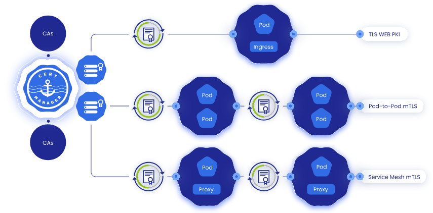

A kubernetes ingress controller is designed to be the access point for HTTP and HTTPS traffic to the software running within your cluster. The ingress-nginx-controller does this by providing an HTTP proxy service supported by your cloud provider's load balancer.

[challenge-types](https://letsencrypt.org/docs/challenge-types/#dns-01-challenge)

### DNS providers who easily integrate with Let’s Encrypt DNS validation

Name(Free)   ACME clients
- cloudflare certbot,acme.sh ,lego and others
- ovh certbot,acme.sh and others
- digital ocean certbot,acme.sh,lego and others
- vultr. acme.sh,lego and others
- hetzner lego,posh-acme and others

[terraform-provisioning-hetzner](https://oghabi.it/blog/cloud-infrastructure-series/terraform-provisioning-hetzner/)

10.2.0.0/16. range 10.2.0.2-10.2.255.254. gateway 10.2.0.1
10.3.0.0/16 range 10.3.0.2- 10.3.255.254 gateway 10.3.0.1

### Management Network (10.0.0.0/16)
The management network hosts the core infrastructure. I designed IP allocation with room for future growth:

Network: 10.0.0.0/16 (65,534 available hosts)
```sh
Subnet allocation:
- 10.0.0.0/24    Infrastructure core (254 hosts)
  ├─ 10.0.0.1    Gateway (reserved)
  ├─ 10.0.0.2    Bastion host (NAT + Jump + VPN)
  ├─ 10.0.0.3    Reserved (future HA bastion)
  ├─ 10.0.0.4    Rancher management cluster
  ├─ 10.0.0.5    Vault server (secrets management)
  ├─ 10.0.0.6    ArgoCD (GitOps)
  └─ 10.0.0.7-10 Reserved for future services

- 10.0.1.0/24    Rancher worker nodes
- 10.0.2.0/24    Monitoring stack (Prometheus, Grafana, Loki)
- 10.0.3.0/24    CI/CD infrastructure
- 10.0.10.0/24+  Reserved for expansion (room for ~240 subnets)
```            

Intra-VPC traffic stays local: Must never exit and re-enter
Internet traffic always goes through NAT gateway: Centralized control

Routing Table: Management Network

```sh
Destination         Next Hop              Priority    Note
10.0.0.0/16        Local                 1           Intra-VPC (higher priority)
0.0.0.0/0          10.0.0.2 (Bastion)    2           Default route via NAT
 ```           
Priority is fundamental: the more specific route (10.0.0.0/16) has priority over the default (0.0.0.0/0). This ensures that a VM wanting to talk to another VM in the same VPC never goes through the bastion.

### Bastion Host Configuration
The bastion is configured as a dual-homed host (two network interfaces):

```sh
eth0 (Public interface):
  - Hetzner public IP
  - Default gateway to internet
  - Exposed to internet (SSH + WireGuard only)

eth1 (Private interface):
  - IP: 10.0.0.2
  - Connected to management VPC
  - Not reachable from internet

Kernel configuration:
  net.ipv4.ip_forward = 1

iptables configuration:
  # NAT for traffic from VPC to internet
  iptables -t nat -A POSTROUTING -s 10.0.0.0/16 -o eth0 -j MASQUERADE

  # Allow forwarding from VPC to internet
  iptables -A FORWARD -i eth1 -o eth0 -j ACCEPT
  iptables -A FORWARD -i eth0 -o eth1 -m state --state RELATED,ESTABLISHED -j ACCEPT

  # Block unsolicited connections from internet to VPC
  iptables -A FORWARD -i eth0 -o eth1 -j DROP
 ```           

How NAT works: When a private VM (e.g., 10.0.0.4) wants to reach the internet (e.g., 8.8.8.8), the packet arrives at the bastion which applies SNAT (Source NAT), replacing the source IP with its own public IP. It maintains a connection tracking table to know where to send replies back. It's completely transparent to VMs. 

No need for cloud-managed NAT gateways
This is the same pattern used in AWS, GCP, Azure, etc., but implemented manually since this is Hetzner.

[multi-tenant-cloud-infrastructure-architecture](https://oghabi.it/blog/multi-tenant-cloud-infrastructure-architecture/)

An IP + /32 means “match exactly this single host”

256 /24 networks fit inside a /16.

IAM (Keycloak),building scalable APIs and cloud‑native architectures with a strong focus on security 

Terraform is more geared to maintaining a Cloud infrastructure, "in the large": acquiring VM-instances, networks, DNS. If you are familiar with AWS, Google Cloud Platform, or in our case Hetzner Cloud , it is what you can do by clicking in their respective UIs or via their APIs like Hetzner's hcloud 

`"Terraform is designed to provision different infrastructure components. Ansible is a configuration-management and application-deployment tool. It means that you'll use Terraform first to create, for example, a virtual machine and then use Ansible to install necessary applications on that machine."`

If your workloads run entirely inside Kubernetes, then Kubernetes itself acts as:
- the orchestration layer
- the deployment system
- the configuration manager (via ConfigMaps, Secrets, CRDs, - Operators)
- the self-healing mechanism
In this model, you typically use:
- Terraform → to provision the cluster (EKS, AKS, GKE, etc.)
- Helm / Kustomize / GitOps tools (Argo CD, Flux) → to deploy and configure applications inside the cluster

Managing Kubernetes nodes (if you self-host clusters)
If you run Kubernetes on bare metal or your own VMs (not managed services), Ansible can help:
- install container runtime
- configure Linux dependencies
- set up kubeadm-based clusters
Many bare-metal Kubernetes deployments use Ansible + kubeadm.

`ingress` is l7 http routing

kube-proxy is the implementation of the service api
it runs on every node in the cluster and uses the node as a proxy for traffic from pods on that node

Services are how you expose l4 load balancer

each path in ingress map to a particular service

ingress is different from service loadbalancer in that a service lb api does not provide for http;no hostnames,no paths,no tls etc

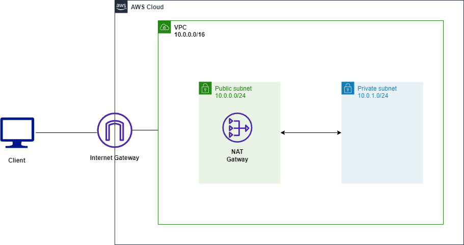

### High Availability & Reliability
- Load Balancers: Deploy Load Balancers to distribute incoming traffic across multiple targets. You can configure health checks (HTTP or TCP) to ensure traffic is only routed to healthy resources
- Volumes: For persistent data, use Volumes. These are SSD-based block storage designed to be highly available and scalable

### Networking & Connectivity
- Private Networks: Use the Networks feature to enable servers to communicate over dedicated private interfaces. This traffic is not available publicly and supports RFC1918 private IP ranges.
- Subnets: Divide your network's IP range into subnets
- Primary IPs: While every server needs a network interface, you can manage Primary IPs (IPv4 and IPv6) to gain more flexibility in how your servers are addressed and moved between resources


### Security Best Practices

- Firewalls: Implement Firewalls to restrict inbound and outbound traffic. By default, firewalls with no inbound rules will drop all traffic, providing a "deny-all" security posture.
- SSH Keys: Always use SSH keys instead of passwords for server access to enhance security. These can be injected into servers at the time of creation.
- Certificates: Use TLS/SSL certificates to encrypt client traffic. The API supports both managed certificates (automatically issued/renewed) and uploaded certificates.
- Resource Protection: Enable deletion protection for critical resources like Images and Volumes to prevent accidental data loss or service disruption.

In a production-grade architecture, certificates are rarely used in isolation. They are typically attached to Load Balancer listeners to terminate SSL/TLS traffic.

In a production environment, manually applying firewalls to every new server is error-prone. Instead, use Label Selectors

Delete Protection: Immediately after creation, call changeLoadBalancerProtection with delete = true. This prevents the deleteLoadBalancer method from executing unless protection is manually removed first

[How to setup a Hetzner K3s Cluster with Traefik SSL](https://www.youtube.com/watch?v=NpLVcHscDXk&t=111s)


a routing table entry: `Destination: 192.168.128.0, Mask: 255.255.128.0, Next Hop: [Interface/IP]`.

No Parent Needed: The router doesn't care if this block was carved out of a larger `192.168.0.0/16` range or not. It only needs to know that any packet destined for an IP between `192.168.128.0` and `192.168.255.255` should be forwarded according to this specific entry.

`The transition from Classful subnetting to CIDR was really about the move to VLSM (Variable Length Subnet Masking).`
- If you divided your Class B into /24s, every subnet had to be a /24.
- If you had a tiny branch office with only 2 computers, you still had to waste a whole /24 (254 addresses) on them because you couldn't mix and match mask lengths.

CIDR allowed "Variable Length" masks.
- You can have one /17 for your main headquarters.
- A /24 for a medium office.
- A /30 (only 2 usable IPs) for a single point-to-point link between routers.
- All within the same address space.

`CIDR introduced Route Summarization (Supernetting)`
Because CIDR doesn't care about classes, an ISP can take 1,000 small customer networks and tell the rest of the internet: "Just send everything starting with 192.168.0.0/16 to me."

The reason CIDR (Classless) was such a big deal is that it allowed Supernetting (moving the mask to the left) and VLSM (Variable Length Subnet Masking)

```sh
Decimal,Binary (2nd Octet)
172.16,10101100.00010000
172.31,10101100.00011111
```
The first 12 bits of the entire IP address (all of the 1st octet and the first 4 bits of the 2nd octet) stay exactly the same: `10101100.0001`. This is why the CIDR is /12.

If the "locked" part is `0001`, what is the biggest number you can make by changing the remaining 4 bits in that octet?
- Result: 00011111
- In decimal, 00011111 is 31.

This is a single /8 block. If we slice it into standard /24 networks:
- Calculation: 24−8=16 bits for subnetting.
- Total Networks: 216= 65,536 networks (each with 254 usable IPs).

Because this range is exactly a /8, it is considered one single Class A network.

172.16.0.0/12 Range
2^(16−12)=2^4= 16 networks.`These are 172.16.x.x,172.17.x.x,…,172.31.x.x.`


A standard Class C is a /24. Since the private range is a /16, it is a "Supernet" made of many Class C networks.
- As Class B networks (/16): It is one single Class B-sized block.
- As Class C networks (/24): 2^(24−16)=2^8= 256 networks.

These are `192.168.0.x,192.168.1.x,…,192.168.255.x`


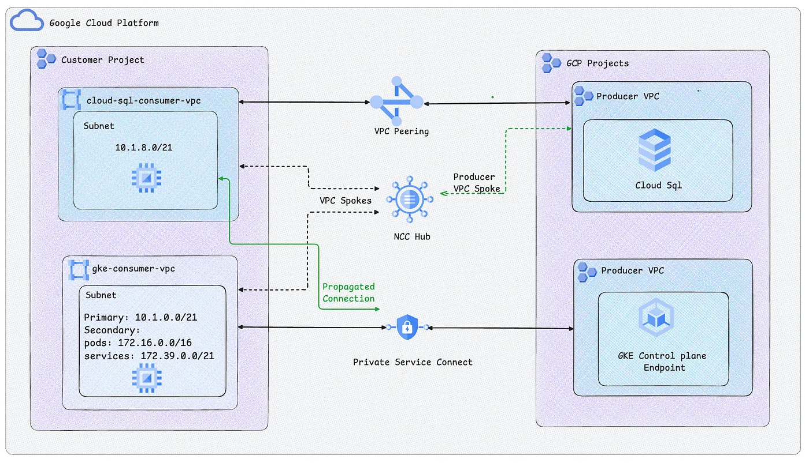


### Generate ssh-keys for servers

Generate a new SSH keys in your terminal called `id_hetzner_entrance and id_hetzner_nodes`. The argument provided with the -f flag creates the key in the current directory and creates four files called `id_hetzner_entrance, id_hetzner_entrance.pub and id_hetzner_nodes, id_hetzner_nodes`.pub. Change the placeholder email address to your email address.

### Generate ssh-key for entrance server

`ssh-keygen -t ed25519 -C "your_email@example.com" -f ~/.ssh/id_hetzner_entrance`

### Generate ssh-key for internal connections

`ssh-keygen -t ed25519 -C "your_email@example.com" -f ~/.ssh/id_hetzner_nodes`

AWS VPC spans a region
subnets are allocated as a subset of the VPC ipv4 or IPV6 CIDR range and span a specific AZ

you can have up to 200 subnets per VPC 

implicit route between all subnets within a VPC

subnets are public subnets when there is a route to an internet gateway

you can have multiple subnets in an AZ but one subnet will not span  more than one AZ

A network access control list(ACL) allows or denies specific inbound or outbound traffic at the subnet level

A route table contains a set of rules called routes, that determine where network trafic from your subent is directed

- Each subnet has associated routing table
- Routing tables can be associated with multiple subnets
- 50 routes per route table by default
- subnets are referred to as "public subnets" when there is a route to an internet gateway

Route tables point to :
- internet gateway or NAT gateway
- Gateway endpoint
- VPC peering/AWS Transit Gateway
- VPN Gateway/ direct Connect

In production, your databases and application servers should never have public IP addresses. You reach them via a Bastion/VPN host

### Zero-Trust Access via SSH CA
Instead of hardcoding individual SSH keys for every developer (which is a security nightmare), advanced teams use a Single Sign-On (SSO) or SSH Certificate Authority.

```scala
object LoadBalancerServiceEnums:
  enum Protocol:
    case `http`
    case `https`
    case `tcp`

```
choosing between TCP, HTTP, and HTTPS determines at which layer of the networking stack your Load Balancer (LB) operates.

The primary distinction is between Layer 4 (Transport) and Layer 7 (Application).

In a production environment, choosing between TCP, HTTP, and HTTPS determines at which layer of the networking stack your Load Balancer (LB) operates. This decision changes how much the LB "knows" about the traffic passing through it.
🛠️ The Core Difference: OSI Layers

The primary distinction is between Layer 4 (Transport) and Layer 7 (Application).

1. tcp (Layer 4 - Transport)
At this level, the Load Balancer is "blind." It only sees the IP address and the Port.
- How it works: It receives a packet and immediately forwards it to a target server without looking at what's inside.
- Pros: Extremely fast, low latency, and handles any protocol (not just web traffic).
- Cons: Cannot read cookies, cannot see the URL path, and cannot handle SSL certificates.
- Best for: Databases (PostgreSQL/Redis), Mail servers, or when you want your application servers to handle their own SSL.

2. http (Layer 7 - Application)
At this level, the Load Balancer is "smart." It "unpacks" the traffic to see the actual content.
- How it works: It can read HTTP Headers, Cookies, and the URL path.
- Pros: Allows for "Path-based routing" (e.g., sending example.com/api to one server and example.com/images to another). It also enables Sticky Sessions using cookies.
- Cons: Slightly higher latency because it has to inspect every packet.
- Best for: Standard web applications where you need intelligent routing or session persistence.

3. https (Layer 7 - Application + Security)
This is http with SSL/TLS Termination.
- How it works: The Load Balancer holds your SSL Certificate. It decrypts the incoming traffic, inspects it (like the HTTP mode), and then sends it to your servers (usually as plain HTTP over the private network).
- Pros: Offloads the heavy work of encryption/decryption from your web servers, making them faster. It also centralizes certificate management.
- Cons: Requires managing certificates on the Load Balancer.
- Best for: Any production website.

```scala
 enum Protocol:
    case `esp` //Encapsulating Security Payload)//Building Site-to-Site VPNs or connecting a local office network to your Hetzner VPC.
    case `gre` //Generic Routing Encapsulation
    case `icmp`
    case `tcp`
    case `udp`

```
these protocols define how the firewall inspects and filters packets at the Network (Layer 3) and Transport (Layer 4) levels of the OSI model    

```sh
Public (DMZ)	10.0.1.0/24	254	Load Balancers, Bastion Hosts, NAT Gateways.
Private (App)	10.0.10.0/22	1,022	Kubernetes Workers, API Servers, Microservices.
Database (Data)	10.0.20.0/24	254	PostgreSQL, Redis, Managed Databases.
Management	10.0.254.0/24	254	Monitoring (Prometheus), Logging, VPN access.
```

A single production Load Balancer often runs multiple services simultaneously. For example:

- Service A (HTTP Redirect): Listens on port 80 just to tell users to go to port 443.
- Service B (HTTPS App): Listens on port 443 for the actual website traffic.
- Service C (API): Listens on port 8443 for a specific mobile API.

Service: The rule/configuration (Protocol + Port).
Target: The actual server (VM) that receives the traffic.

In a real production environment, manually listing Server IDs is considered "brittle." If you add a new worker node, you have to remember to update the firewall attachment.

```scala
object LoadBalancerTargetEnums:
  enum Type:
    case `ip`
    case `label_selector`
    case `server`
```
Instead, production setups use Label Selectors. You tell the Firewall: "Apply these rules to any server that has the label app=kubernetes."


In a production environment, a Label Selector is the secret to building "Self-Healing" and "Auto-Scaling" infrastructure.
Instead of manually telling the Load Balancer exactly which Server ID to send traffic to (which is fragile), you give the Load Balancer a Search Query.

You created one Layer-3 routed private network.
Inside that network, all subnets (like 10.0.1.0/24, 10.0.9.0/24, etc.) are:
- automatically routed toward each other
- automatically reachable
- NOT isolated

- to generate a new ssh key, run ` ssh-keygen -t ed25519 -C "youremailaddress" and enter a passphrase when prompted
- copy your ssh public key to your hetzner server
`cat .ssh/vps_tutorial | pbcopy`
- add your key to the ssh agent `ssh add ~/.ssh/vps_tutorial` and enter passphrase


- `Allow Cloudflare IPs for tunnel (egress only, no ingress needed)`
- cloudflared establishes outbound connections

[K3s on Hetzner with Terraform](https://renanhillesheim.com/posts/newpost/)

[setup-highly-available-kubernetus-cluster-with-hetzner-cloud-and-terraform-](https://alexslubsky.medium.com/setup-highly-available-kubernetus-cluster-with-hetzner-cloud-and-terraform-941a9e25ddf6)

DNS (Domain Name System) is the most fundamental and widely used form of Service Discovery.

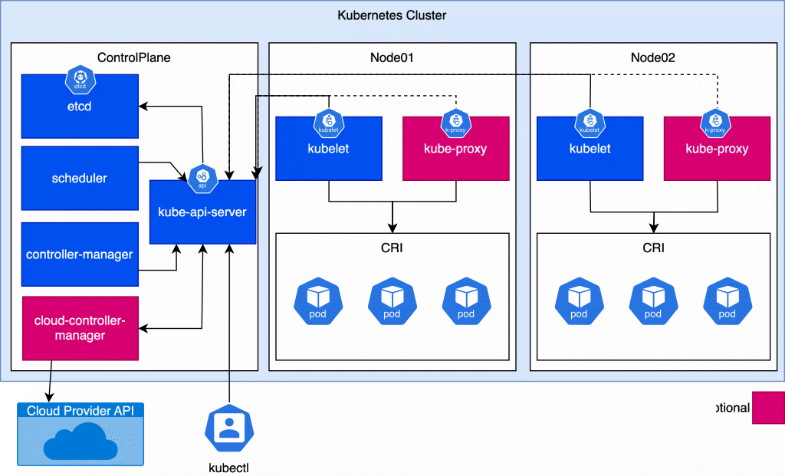

[components-of-kubernetes](https://schoenwald.aero/posts/2025-02-26_components-of-kubernetes/)

[What Is a YubiKey and When to Use It vs. Authenticator Apps](https://supertokens.com/blog/yubikeys#:~:text=When%20you%20register%20a%20YubiKey%20with%20a%20service%2C%20here's%20what,stores%20public%20key%20%2B%20credential%20ID)

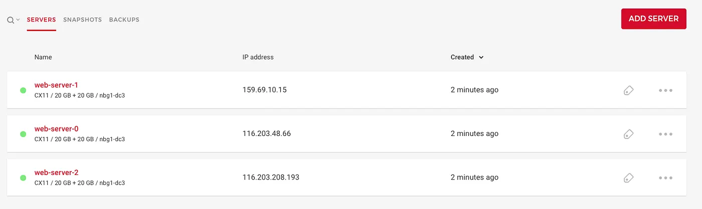

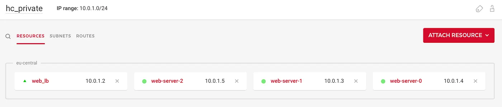

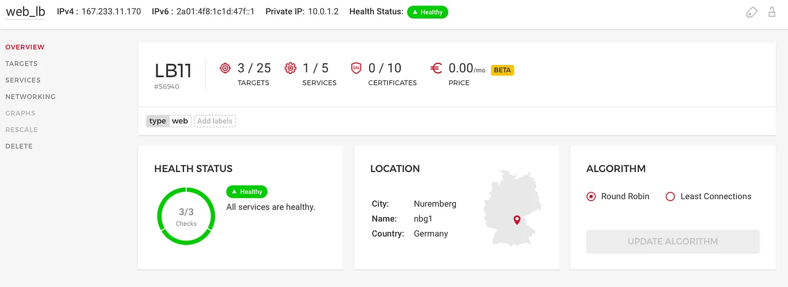

[set-up-infrastructure-in-hetzner-cloud-using-terraform-](https://medium.com/@orestovyevhen/set-up-infrastructure-in-hetzner-cloud-using-terraform-ce85491e92d)


```scala

case class LoadBalancer(
  @named("algorithm") algorithm: LoadBalancerAlgorithm,
  /* Point in time when the Resource was created (in ISO-8601 format). */
  @named("created") created: String,
  /* ID of the Load Balancer. */
  @named("id") id: Long,
  /* Free Traffic for the current billing period in bytes. */
  @named("included_traffic") includedTraffic: Long,
  /* Inbound Traffic for the current billing period in bytes. */
  @named("ingoing_traffic") ingoingTraffic: Long,
  /* User-defined labels (`key/value` pairs) for the Resource. For more information, see \"Labels\".  | User-defined labels (`key/value` pairs) for the Resource.  Note that the set of Labels provided in the request will overwrite the existing one.  For more information, see \"Labels\".  */
  @named("labels") labels: Map[String, String],
  @named("load_balancer_type") loadBalancerType: LoadBalancerType,
  @named("location") location: Location,
  /* Name of the Resource. Must be unique per Project. */
  @named("name") name: String,
  /* Outbound Traffic for the current billing period in bytes. */
  @named("outgoing_traffic") outgoingTraffic: Long,
  /* Private networks information. */
  @named("private_net") privateNet: Seq[LoadBalancerPrivateNet],
  @named("protection") protection: Protection,
  @named("public_net") publicNet: LoadBalancerPublicNet,
  /* List of services that belong to this Load Balancer. */
  @named("services") services: Seq[LoadBalancerService],
  /* List of targets that belong to this Load Balancer. */
  @named("targets") targets: Seq[LoadBalancerTarget]
)

```

[Load Balancers Made Easy on Hetzner Cloud with Terraform](https://www.youtube.com/watch?v=_GB5HHnA0zE&t=172s)

There are 3 loadbalancer types lb11,lb21 and lb31
- lb11 supports five services, 25 targets and 10 ssl certificates
- lb21 supports 15 services,75 targets and 25 ssl certificates
- lb31 supports 30 services, 150 targets and 50 ssl certificates

A loadbalancer must be located in the same network zone as the targets

```scala
  /**
   * LoadBalancerTarget
   * A target of a Load Balancer.
   */
case class LoadBalancerTarget(
  /* Type of the resource. */
  @named("type") `type`: LoadBalancerTargetEnums.Type,
  /* List of health statuses of the services on this target. Only present for target types \"server\" and \"ip\". */
  @named("health_status") healthStatus: Option[Seq[LoadBalancerTargetHealthStatus]] = scala.None,
  @named("ip") ip: Option[LoadBalancerTargetIp] = scala.None,
  @named("label_selector") labelSelector: Option[LabelSelector] = scala.None,
  @named("server") server: Option[ResourceId] = scala.None,
  /* List of resolved label selector target Servers. Only present for type \"label_selector\". */
  @named("targets") targets: Option[Seq[LoadBalancerSelectedTarget]] = scala.None,
  /* Use the private network IP instead of the public IP. Only present for target types \"server\" and \"label_selector\". */
  @named("use_private_ip") usePrivateIp: Option[Boolean] = scala.None
)

object LoadBalancerTargetEnums:
  enum Type:
    case `ip`
    case `label_selector`
    case `server`

```
sets up the targets that we want the loadbalancer to route traffic to
A target tells the loadbalancer which servers it should use to route its traffic when we have it setup
`LoadBalancerTarget.Type` tells the loadbalancer the kind of services we want to identify for its routing

- `server` allows us to specify the server by its id
- `ip` allows us use an ip address that points to a cloud server located in the same network zone

These two work but have their limitations:
- if we want to setup the loadbalancer to look up the target by IP, we will likely need to use static IP addresses in case we recreate the server and that incurs some additional costs
- The main limitation with setting the targets by server id or IP adddress is that if we scale our infrastructure up and add new servers,we will need to manually add these targets to the load balancer configuration,which is really easy to forget

A more convenient and maintainable approach is to configure the targets by using the `label selector` type. This seting tells the loadbalancer to look for any server that has specific label setup and automatically set them as targets.
When you create new servers on hetzner cloud or almost any cloud provider for that matter, you can optionally seet labels to identify them for different purposes.


### Service

```scala
  /**
   * LoadBalancerService
   * A service for a Load Balancer.
   */
case class LoadBalancerService(
  /* Port the Load Balancer will balance to. */
  @named("destination_port") destinationPort: Int,
  @named("health_check") healthCheck: LoadBalancerServiceHealthCheck,
  /* Port the Load Balancer listens on. */
  @named("listen_port") listenPort: Int,
  /* Protocol of the Load Balancer. */
  @named("protocol") protocol: LoadBalancerServiceEnums.Protocol,
  /* Is Proxyprotocol enabled or not. */
  @named("proxyprotocol") proxyprotocol: Boolean,
  @named("http") http: Option[Http] = scala.None
)

  /**
   * LoadBalancerServiceHealthCheck
   * Service health check.
   */
case class LoadBalancerServiceHealthCheck(
  /* Time interval in seconds health checks are performed. */
  @named("interval") interval: Int,
  /* Port the health check will be performed on. */
  @named("port") port: Int,
  /* Type of the health check. */
  @named("protocol") protocol: LoadBalancerServiceHealthCheckEnums.Protocol,
  /* Unsuccessful retries needed until a target is considered unhealthy; an unhealthy target needs the same number of successful retries to become healthy again. */
  @named("retries") retries: Int,
  /* Time in seconds after an attempt is considered a timeout. */
  @named("timeout") timeout: Int,
  @named("http") http: Option[LoadBalancerServiceHealthCheckHttp] = scala.None
)
```

- specifies the protocol(http,https or tcp) and the port (80,443 etc) for handling traffic
- performs health checks on targets to ensure they are available

For loadbalancers, a service the protocol and port the loadbalancer will use for handling traffic
- it is also responsible for performing health checks on targets to check if any of them are unavailable, so the loadbalancer doesn't send traffic to a server that is not working

for web servers, we use http or https and for this we need health checks to keep track of active servers

`LoadBalancerServiceHealthCheckEnums.Protocol` is different from `LoadBalancerServiceEnums.Protocol`.. The loadbalancer service protocol tells the service which protocol to use for the type of traffic the loadbalancer will accept while `LoadBalancerServiceHealthCheckEnums.Protocol` tells the service which protocol to use for checking that a server is up..Typpically, both would use the same protocol

We need to specify which port the health check should ping. the application for each web server is accessible on port `80`
`path` specifies where the health check needs to make its requests
indicates the path of the http requests made to the target..Let's say my application has a health check endpoint at `/health` or `/up`
`statusCode` is an array of strings containing the http status codes that the health check uses to determine whether a target is healthy or unhealthy.. By default health checks pass if the path returns `2xx` or `3xx` status code

if the load balancer does tls termination then route the unencrypted traffic to the target through normal http

if you need to ensure encrypted communication between the loadbalancer and the targets(servers), you need to setup your loadbalancer service to use the tcp protocol
loadbalancers can work with https using protocol using TLS termination. secure requests end at the load balancer and then route the unencrypted traffic to the Target through normal HTTP

### https
when setting up a aloadbalancer service that uses tls termination
- you first need to setup an ssl certificate for your hetzner cloud project
There are two ways
- upload an existing ssl certifcate and its private key to hetzner cloud
- let hetzner cloud generate an ssl certificate using let's Encrypt


Terraform relies on plugins called providers to interact with cloud providers, SaaS providers, and other APIs.


## Terraform
Terraform configurations must declare which providers they require so that Terraform can install and use them
Every resource type is implemented by a provider; without providers, Terraform can't manage any kind of infrastructure

Terraform Core has zero knowledge of AWS, Azure, GCP, or Kubernetes.
It doesn’t know what an EC2 instance is, or how to spin up a Kubernetes pod.

Terraform’s core engine only knows how to:
- Read your .tf files.
- Build a dependency graph.
- Compare desired vs actual state.
- Plan and apply changes.

On its own, Terraform is just a really smart orchestrator. But it has no clue how to actually talk to cloud APIs.
`So Providers act as an interface between Terraform and the cloud APIs`
`Providers = API Translators`

Every cloud or service (AWS, Azure, Kubernetes, GitLab, Datadog, MongoDB etc.) exposes an API.The problem? Each one looks different.

That’s where providers step in:
- They know the API endpoints.
- They handle authentication.
- They define the schema for resources (ami, instance_type, bucket_name, etc.).
- They translate Terraform configs into real Create/Read/Update/Delete (CRUD) API calls.

L4 loadbalancers use Network address translation while l7 do not

`.dependsOn(hcloud-codegen % "compile->compile")`
Those compiled `.class` files are added to the classpath.

You write this in `root/src/main/scala`:
`import authlete.codegen.Client`
For this to compile, the compiler must find:
`authlete/codegen/Client.class`
on the classpath.

## Bastion
The Private Network: You have several VMs that do not have public IP addresses. They are safe from the open internet but you can't access them directly from your home computer.

The Bastion (The "Bridge"): You create one small VM that has two network interfaces: one connected to the public internet and one connected to the Hetzner private network.

The Access Flow: You SSH into the Bastion first, and from there, you "jump" to the other private VMs.

`ssh -J root@bastion-ip root@private-vm-ip`

Instead of typing out that long command every time, you can save it in your local SSH configuration file. This is also a general Linux/Mac feature.

Open (or create) the file ~/.ssh/config on your laptop.
```sh
# The Bastion (Public Facing)
Host bastion
    HostName 1.2.3.4  # The Public IP
    User root

# The Private Server
Host internal-server
    HostName 10.0.0.5 # The Private IP
    User root
    ProxyJump bastion
```
The Result: Now, you don't need the `-J` flag or the IP addresses anymore. You can just type: `ssh internal-server`


### What is a vSwitch

A vSwitch is a virtual layer 2 switch. Think of it as a private network just for your servers. Any Hetzner server you own in the same location whether it is a cloud instance or a dedicated machine can be connected to it.

Once connected your servers can talk to each other using private IP addresses like 10.0.0.1. This traffic never touches the public internet. It is fast secure and free. 

### Connecting "Robot" to "Cloud"
The biggest reason to use a vSwitch at Hetzner is that Cloud Networks and Dedicated Servers (Robot) live in two different worlds.

`Subnets in Cloud Console`: These only work for Cloud VMs. You c`annot simply "add" a physical Dedicated server to a standard Cloud Network.
`vSwitch`: This acts as a bridge. It allows a physical machine in the Hetzner datacenter to "plug in" to the same virtual wire that your Cloud VMs are using

### VLAN Isolation
When you use a vSwitch, Hetzner gives you a VLAN ID (usually between 4000 and 4091).
- This VLAN ID ensures that your "10.0.0.1" is completely isolated from another customer who might also be using "10.0.0.1" in the same datacenter.
- The vSwitch handles the "tagging" of your traffic so it only goes to your servers and nowhere else

[Hetzner Private Networking The Simple Way](https://banerjeerishi.com/text/hetzner-private-networking-the-simple-way.html#:~:text=For%20a%20dedicated%20server%20you,on%20the%20same%20private%20network.)

For a dedicated server you go back to the Robot panel and simply attach it. For a cloud server you navigate to your project go to Networks and add a subnet to your vSwitch. Then you can attach your cloud servers to this network. The key is that both server types can live on the same private network. This is powerful if you run your database on a powerful dedicated server and your web servers on flexible cloud instances

Inside each dedicated server's OS, you create a sub-interface (like eth0.4000) that matches that ID.


`every pod has a unique IP address from other pods in the cluster`

ip address reachable from all other pods in the cluster

pods address the issue of container port mapping.. bind host port to application port in container eg 5432:5432

when you have hundreds of containers on your server, how can you keep track of what pods are still available? kubernetes solves this issue by abstracting containers using pods

## Wireguard
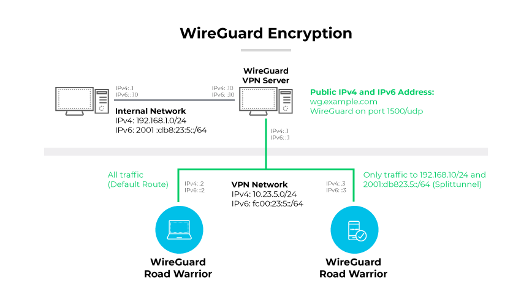

 WireGuard is a high-performance VPN that runs in the Linux kernel. It uses modern cryptography and is easier to configure than other VPN solutions.

  WireGuard uses the following protocols and primitives:

- ChaCha20 for symmetric encryption, authenticated with Poly1305, using Authenticated Encryption with Associated Data (AEAD) construction
- Curve25519 for Elliptic-curve Diffie-Hellman (ECDH) key exchange
- BLAKE2s for hashing and keyed hashing
- SipHash24 for hash table keys
- HKDF for key derivation 

WireGuard operates on the network layer (layer 3). Therefore, you cannot use DHCP and must assign static IP addresses or IPv6 global addresses to the tunnel devices on both the server and clients

### How WireGuard uses tunnel IP addresses, public keys, and remote endpoints

WireGuard’s design tightly couples network routing with cryptographic identity, creating a Cryptokey Routing Table. This system enables the protocol to function as both a routing mechanism for outgoing traffic and an access control list for incoming packets, ensuring that only authenticated and authorized traffic is processed.

When WireGuard sends a network packet to a peer:

- WireGuard reads the destination IP from the packet and compares it to the list of allowed IP addresses in the local configuration. If the peer is not found, WireGuard drops the packet.
- If the peer is valid, WireGuard encrypts the packet using the peer’s public key.
- The sending host looks up the most recent Internet IP address of the host and sends the encrypted packet to it. 

When WireGuard receives a packet:

- WireGuard decrypts the packet using the private key of the remote host.
- WireGuard reads the internal source address from the packet and looks up whether the IP is configured in the list of allowed IP addresses in the settings for the peer on the local host. If the source IP is on the allowlist, WireGuard accepts the packet. If the IP address is not on the list, WireGuard drops the packet. 

### Using a WireGuard client behind NAT and firewalls

WireGuard uses the UDP protocol and transmits data only when a peer sends packets. Stateful firewalls and network address translation (NAT) on routers track connections to enable a peer behind NAT or a firewall to receive packets. 

Create a private key and a corresponding public key for the host: 
`wg genkey | tee /etc/wireguard/$HOSTNAME.private.key | wg pubkey > /etc/wireguard/$HOSTNAME.public.key`

Set secure permissions on the key files: 
`chmod 600 /etc/wireguard/$HOSTNAME.private.key /etc/wireguard/$HOSTNAME.public.key`
600 =
- read + write for the owner (root)
- no permissions for group
- no permissions for others
```sh
#On this host
[Interface]
PrivateKey = <contents of .private.key>
Address = 10.0.0.1/32
# On other peers
[Peer]
PublicKey = <contents of .public.key>
AllowedIPs = 10.0.0.1/32
```
Make sure the directory itself is protected:
`chmod 700 /etc/wireguard`

- File permissions control access to the file’s contents.
- Directory permissions control access to the file’s name and path.

#### Why file permissions alone are NOT enough
Let’s say you do this:
`chmod 600 /etc/wireguard/host.private.key`
But the directory is still:
`drwxr-xr-x  /etc/wireguard`
What others can still do
Even though they can’t read the file contents, they can still:
- list the directory
- see that a private key exists
- see filenames
- see timestamps, sizes
- potentially replace or delete files (depending on perms)
Example attack surface:
```sh
ls /etc/wireguard
# host.private.key
# host.public.key
```
This leaks metadata and structure.

Directory permissions mean something different:
Permission	Meaning on directory
- r	Can list filenames
- w	Can create/delete/rename files
- x	Can access files if you know the name
This is crucial.
What `chmod 700 /etc/wireguard` does
`drwx------  root root  /etc/wireguard`
This means:
Only root can:
- list files
- access files
- create/delete files

Important attributes of a WireGuard interface are:
- **Private key**: together with the corresponding public key, they are used to authenticate and encrypt data. This is generated with the wg genkey command.
- **Listen port**: the UDP port that WireGuard will be listening to for incoming traffic.
- **List of peers**, each one with:
 - Public key: the public counterpart of the private key. Generated from the private key of that peer, using the wg pubkey command.

 - Endpoint: where to send the encrypted traffic to. This is optional, but at least one of the corresponding peers must have it to bootstrap the connection.
 - Allowed IPs: list of inner tunnel destination networks or addresses for this peer when sending traffic, or, when receiving traffic, which source networks or addresses are allowed to send traffic to us.

 ```sh
[Interface]
PrivateKey = eJdSgoS7BZ/uWkuSREN+vhCJPPr3M3UlB3v1Su/amWk=
ListenPort = 51000
Address = 10.10.11.10/24

[Peer]
# office
PublicKey = xeWmdxiLjgebpcItF1ouRo0ntrgFekquRJZQO+vsQVs=
Endpoint = wg.example.com:51000 # fake endpoint, just an example
AllowedIPs = 10.10.11.0/24, 10.10.10.0/24
```

This is what it looks like when this interface is brought up by wg-quick:
```sh
$ sudo wg-quick up wg0
[#] ip link add wg0 type wireguard
[#] wg setconf wg0 /dev/fd/63
[#] ip -4 address add 10.10.11.10/24 dev wg0
[#] ip link set mtu 1420 up dev wg0
[#] ip -4 route add 10.10.10.0/24 dev wg0
```
This is what wg-quick:
- Created the WireGuard `wg0` interface.
- Configured it with the data from the configuration file.
- Added the IP/CIDR from the Address field to the `wg0` interface.
- Calculated a proper MTU (which can be overridden in the config if needed).
- Added a route for `AllowedIPs`.

Note that in this example `AllowedIPs` is a list of two CIDR network blocks, but `wg-quick` only added a route for `10.10.10.0/24` and skipped `10.10.11.0/24`. That’s because the Address was already specified as a /24 one. Had we specified the address as 10.10.11.10/32 instead, then wg-quick would have added a route for 10.10.11.0/24 explicitly.

o better understand how AllowedIPs work, let’s go through a quick example.

Let’s say this system wants to send traffic to `10.10.10.201/24`. There is a route for it which says to use the wg0 interface for that:

```sh
$ ip route get 10.10.10.201
10.10.10.201 dev wg0 src 10.10.11.10 uid 1000
    cache
```

Since `wg0` is a WireGuard interface, it will consult its configuration to see if any peer has that target address in the `AllowedIPs` list. Turns out one peer has it, in which case the traffic will:

a) Be authenticated as us, and encrypted for that peer. b) Sent away via the configured Endpoint.

Now let’s picture the reverse. This system received traffic on the ListenPort UDP port. If it can be decrypted, and verified as having come from one of the listed peers using its respective public key, and if the source IP matches the corresponding `AllowedIPs` list, then the traffic is accepted.

What if there is no Endpoint? Well, to bootstrap the VPN, at least one of the peers must have an Endpoint, or else it won’t know where to send the traffic to, and you will get an error saying “Destination address required”

But once the peers know each other, the one that didn’t have an Endpoint setting in the interface will remember where the traffic came from, and use that address as the current endpoint. This has a very nice side effect of automatically tracking the so called “road warrior” peer, which keeps changing its IP. This is very common with laptops that keep being suspended and awakened in a new network, and then try to establish the VPN again from that new address.

- Each peer participating in the WireGuard VPN has a private key and a public key.
- AllowedIPs is used as a routing key when sending traffic, and as an ACL when receiving traffic.
- To establish a VPN with a remote peer, you need its public key. Likewise, the remote peer will need your public key.
- At least one of the peers needs an Endpoint configured in order to be able to initiate the VPN.


`A connected route is a route to a network that is directly attached to an interface because the interface has an IP address in that network.`

`ip addr add 192.168.1.50/24 dev eth0`
Linux adds:
`192.168.1.0/24 dev eth0 proto kernel scope link`
`traffic can leave a device without a connected route to the destination — but it can never leave without a connected route (or equivalent) to the next hop`

Why this design exists
Because:
- Ethernet requires a MAC address
- MAC addresses are resolved via ARP
- ARP only works on connected networks

## WireGuard VPN peer-to-site

This is probably the most common setup for a VPN: connecting a single system to a remote site, and getting access to the remote network “as if you were there”.

```sh
               public internet
     
                xxxxxx      ppp0 ┌────────┐
 ┌────┐         xx   xxxx      ──┤ router │
 │    ├─ppp0  xxx      xx        └───┬────┘
 │    │       xx        x            │         home 10.10.10.0/24
 │    │        xxx    xxx            └───┬─────────┬─────────┐
 └────┘          xxxxx                   │         │         │
                                       ┌─┴─┐     ┌─┴─┐     ┌─┴─┐
                                       │   │     │   │     │   │
                                       │pi4│     │NAS│     │...│
                                       │   │     │   │     │   │
                                       └───┘     └───┘     └───┘
```
This diagram represents a typical simple home network setup. You have a router/modem, usually provided by the ISP (Internet Service Provider), and some internal devices like a Raspberry PI perhaps, a NAS (Network Attached Storage), and some other device.

There are basically two approaches that can be taken here: install WireGuard on the router, or on another system in the home network.

`Note that in this scenario the “fixed” side, the home network, normally won’t have a WireGuard Endpoint configured, as the peer is typically “on the road” and will have a dynamic IP address.`

### WireGuard VPN peer-to-site (on router)

In this diagram, we are depicting a home network with some devices and a router where we can install WireGuard.

```sh
                       public internet              ┌─── wg0 10.10.11.1/24
10.10.11.2/24                                       │        VPN network
        home0│            xxxxxx       ppp0 ┌───────┴┐
           ┌─┴──┐         xx   xxxxx  ──────┤ router │
           │    ├─wlan0  xx       xx        └───┬────┘    home network, .home domain
           │    │       xx        x             │.1       10.10.10.0/24
           │    │        xxx    xxx             └───┬─────────┬─────────┐
           └────┘          xxxxxx                   │         │         │
Laptop in                                         ┌─┴─┐     ┌─┴─┐     ┌─┴─┐
Coffee shop                                       │   │     │   │     │   │
                                                  │pi4│     │NAS│     │...│
                                                  │   │     │   │     │   │
                                                  └───┘     └───┘     └───┘
```

`router`: the existing router at the home network. It has a public interface ppp0 that has a routable but dynamic IPv4 address (not CGNAT), and an internal interface at 10.10.10.1/24 which is the default gateway for the home network.
`home network`: the existing home network (`10.10.10.0/24 `in this example), with existing devices that the user wishes to access remotely over the WireGuard VPN.

`10.10.11.0/24`: the WireGuard VPN network. This is a whole new network that was created just for the VPN users.

`wg0` on the router: this is the WireGuard interface that we will bring up on the router, at the `10.10.11.1/24` address. It is the gateway for the 1`0.10.11.0/24` VPN network.

With this topology, if, say, the NAS wants to send traffic to `10.10.11.2/24`, it will send it to the default gateway (since the NAS has no specific route to 10.10.11.0/24), and the gateway will know how to send it to `10.10.11.2/24` because it has the wg0 interface on that network.

The [Peer] section is identifying a peer via its public key, and listing who can connect from that peer. This AllowedIPs setting has two meanings:
- When sending packets, the AllowedIPs list serves as a routing table, indicating that this peer’s public key should be used to encrypt the traffic.
- When receiving packets, AllowedIPs behaves like an access control list. After decryption, the traffic is only allowed if it matches the list.

```sh
sudo wg-quick up wg0
[#] ip link add wg0 type wireguard
[#] wg setconf wg0 /dev/fd/63
[#] ip -4 address add 10.10.11.1/24 dev wg0
[#] ip link set mtu 1378 up dev wg0
```
Verify you have a `wg0` interface up with an address of `10.10.11.1/24`:
```sh
$ ip a show dev wg0
9: wg0: <POINTOPOINT,NOARP,UP,LOWER_UP> mtu 1378 qdisc noqueue state UNKNOWN group default qlen 1000
    link/none
    inet 10.10.11.1/24 scope global wg0
       valid_lft forever preferred_lft forever
```
And a route to the `10.10.1.0/24` network via the wg0 interface:

```sh
$ ip route | grep wg0
10.10.11.0/24 dev wg0 proto kernel scope link src 10.10.11.1
```

on router `sysctl net.ipv4.ip_forward=1`

Destination: 10.10.10.20
Is 10.10.10.20 in 10.10.10.0/24? 
Route says: dev wg0

So Linux sends the packet into the WireGuard interface.

```sh
src = 10.10.11.2
dst = 10.10.10.20
```
WireGuard encrypts it
Wraps it in UDP
Sends it to:
router_public_ip:51000


### WireGuard on an internal system (peer-to-site)
To recap, our home network has the 10.10.10.0/24 address, and we want to connect to it from a remote location and be “inserted” into that network as if we were there:

```sh
                       public internet
10.10.10.11/24
        home0│            xxxxxx       ppp0 ┌────────┐
           ┌─┴──┐         xx   xxxxx  ──────┤ router │
           │    ├─ppp0  xxx       xx        └───┬────┘    home network, .home domain
           │    │       xx        x             │         10.10.10.0/24
           │    │        xxx    xxx             └───┬─────────┬─────────┐
           └────┘          xxxxxx                   │         │         │
                                                  ┌─┴─┐     ┌─┴─┐     ┌─┴─┐
                                            wg0 ──┤   │     │   │     │   │
                                  10.10.10.10/32  │pi4│     │NAS│     │...│
                                                  │   │     │   │     │   │
                                                  └───┘     └───┘     └───┘
Reserved for VPN users:
10.10.10.10-49
```

[wireguard-vpn/on-an-internal-system](https://documentation.ubuntu.com/server/how-to/wireguard-vpn/on-an-internal-system/)


### WireGuard VPN site-to-site
Another usual VPN configuration where one could deploy WireGuard is to connect two distinct networks over the internet
```sh
                      ┌─────── WireGuard tunnel ──────┐
                      │         10.10.9.0/31          │
                      │                               │
         10.10.9.0 wgA│               xx              │wgB 10.10.9.1
                    ┌─┴─┐          xxx  xxxx        ┌─┴─┐
    alpha site      │   │ext     xx        xx    ext│   │  beta site
                    │   ├───    x           x    ───┤   │
    10.10.10.0/24   │   │      xx           xx      │   │  10.10.11.0/24
                    │   │      x             x      │   │
                    └─┬─┘      x              x     └─┬─┘
            10.10.10.1│        xx             x       │10.10.11.1
    ...┌─────────┬────┘          xx   xxx    xx       └───┬─────────┐...
       │         │                  xx   xxxxx            │         │
       │         │                                        │         │
     ┌─┴─┐     ┌─┴─┐           public internet          ┌─┴─┐     ┌─┴─┐
     │   │     │   │                                    │   │     │   │
     └───┘     └───┘                                    └───┘     └───┘
```

Since we are not assigning VPN IPs to all systems on each side, the VPN network here will be very small (a /31, which allows for two IPs) and only used for routing. The only systems with an IP in the VPN network are the gateways themselves.

There will be no NAT applied to traffic going over the WireGuard network. Therefore, the networks of both sites must be different and not overlap.

Technically, a /31 Classless Inter-Domain Routing (CIDR) network has no usable IP addresses, since the first one is the network address, and the second (and last) one is the broadcast address. RFC 3021 allows for it, but if you encounter routing or other networking issues, switch to a /30 CIDR and its two valid host IPs.

```sh
WireGuard is being set up on the gateways for these two networks. As such, there are no changes needed on individual hosts of each network, but keep in mind that the WireGuard tunneling and encryption is only happening between the alpha and beta gateways, and NOT between the hosts of each network.
```

[wireguard-vpn-site-to-site](https://documentation.ubuntu.com/server/how-to/wireguard-vpn/site-to-site/#wireguard-vpn-site-to-site)


### Using the VPN as the default gateway

WireGuard can be set up to route all traffic through the VPN, and not just specific remote networks. There could be many reasons to do this, but mostly they are related to privacy

```sh
                       public untrusted          ┌── wg0 10.90.90.2/24
10.90.90.1/24          network/internet          │   VPN network
        wg0│            xxxxxx            ┌──────┴─┐
         ┌─┴──┐         xx   xxxxx  ──────┤ VPN gw │
         │    ├─wlan0  xx       xx   eth0 └────────┘
         │    │       xx        x 
         │    │        xxx    xxx
         └────┘          xxxxxx
         Laptop

```

### DNS leaks

The traffic is now being routed through the VPN to the gateway server that you control, and from there onward, to the Internet at large. The local network you are in cannot see the contents of that traffic, because it’s encrypted. But you are still leaking information about the sites you access via DNS.

When the laptop got its IP address in the local (untrusted) network it is in, it likely also got a pair of IPs for DNS servers to use. These might be servers from that local network, or other DNS servers from the internet like 1.1.1.1 or 8.8.8.8. When you access an internet site, a DNS query will be sent to those servers to discover their IP addresses. Sure, that traffic goes over the VPN, but at some point it exits the VPN, and then reaches those servers, which will then know what you are trying to access.
[Using the VPN as the default gateway](https://documentation.ubuntu.com/server/how-to/wireguard-vpn/vpn-as-the-default-gateway/#using-the-vpn-as-the-default-gateway)

### dev eth0 with a gateway (most common)
`10.10.21.0/24 via 192.168.1.1 dev eth0`

- Routing selects this route
- Kernel sees via 192.168.1.1
- Kernel must answer:
“Can I reach 192.168.1.1 directly on eth0?”
That requires a connected route such as:
192.168.1.0/24 dev eth0 scope link

### dev eth0 without a gateway (directly connected)
`192.168.1.0/24 dev eth0 scope link`

a gateway (`via`)

`[ 8 bits ] [ 6 net | 2 host ] [ 8 host ] [ 8 host ]`

We vary only 2 bits in the second octet because the other 16 host bits are in the third and fourth octets, which are already understood to vary fully.

172.16.0.0/14
172.16.0.0 – 172.19.255.255

172.16 = 00010000
172.17 = 00010001
172.18 = 00010010
172.19 = 00010011
All of these preserve the first 6 bits of the second octet.
When you reach 20:
The network bits change from:
000100 → 000101

/14 is 2 bits longer than /12 (14 − 12 = 2), so you must take two bits from the host portion and make them network bits.

Those 2 newly-networked bits can take 4 combinations (00, 01, 10, 11), so the /12 is split into 4 /14 subnets:
